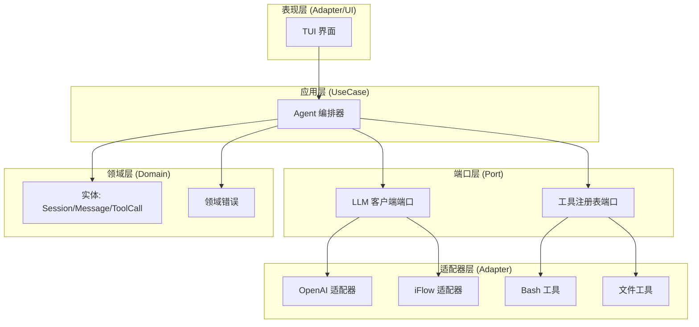
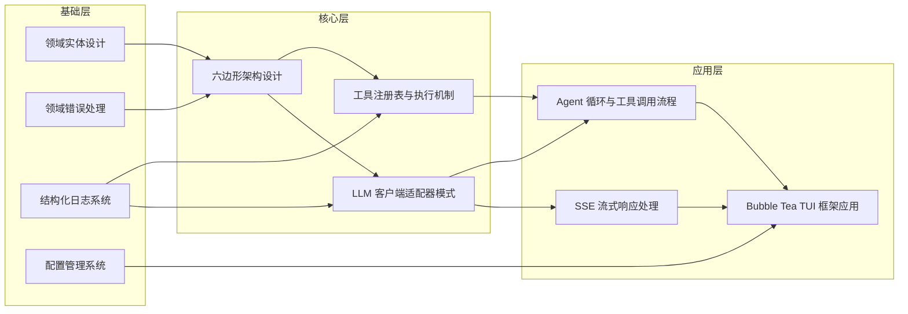
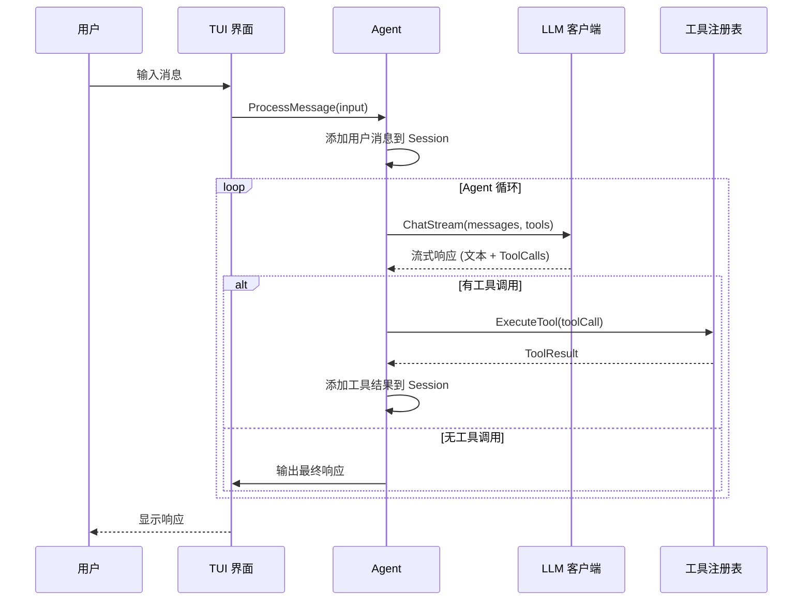

# AI Code 源码知识点地图

> **项目**: ai_code (copilot)  
> **分析日期**: 2026-03-27  
> **Go 版本**: 1.24.2

---

## 项目总览

### 项目画像

| 属性 | 描述 |
|------|------|
| **项目名称** | AI Code (copilot) |
| **编程语言** | Go 1.24.2 |
| **项目定位** | 基于 LLM 的命令行 AI 编码助手，支持工具调用与流式输出 |
| **核心框架** | Bubble Tea TUI + 六边形架构 |

### 技术栈

- **UI 框架**: [Bubble Tea](https://github.com/charmbracelet/bubbletea) (TUI)
- **样式渲染**: [Lipgloss](https://github.com/charmbracelet/lipgloss)
- **配置管理**: YAML + 环境变量
- **日志系统**: slog + lumberjack (日志轮转)
- **LLM 接口**: OpenAI 兼容 API

### 整体架构思想

项目采用**六边形架构（端口-适配器模式）**，核心业务逻辑与外部依赖解耦：

- **Domain Layer**: 定义实体（Entity）和端口接口（Port）
- **Adapter Layer**: 实现具体的 LLM 客户端、工具、UI 适配器
- **UseCase Layer**: 编排业务逻辑，实现 Agent 循环

```
用户输入 → TUI → Agent → LLM → 工具执行 → 结果输出
                ↑__________________|
                   (循环直到完成)
```

### 系统架构概览



---

## 核心目录结构

```
copilot/
├── main.go                    # 应用入口
├── config/config.yaml         # 配置文件
├── internal/
│   ├── adapter/               # 适配器层
│   │   ├── llm/               # LLM 客户端实现
│   │   │   ├── base.go        # 基础客户端（共享逻辑）
│   │   │   ├── factory.go     # 工厂注册表
│   │   │   ├── openai.go      # OpenAI 兼容客户端
│   │   │   └── iflow.go       # iFlow 客户端
│   │   ├── tool/              # 工具实现
│   │   │   ├── registry.go    # 工具注册表
│   │   │   ├── bash.go        # Bash 命令工具
│   │   │   ├── read_file.go   # 文件读取工具
│   │   │   ├── write_file.go  # 文件写入工具
│   │   │   ├── edit_file.go   # 文件编辑工具
│   │   │   └── todo.go        # Todo 管理工具
│   │   └── ui/tui/            # TUI 界面
│   │       ├── model.go       # TUI 状态模型
│   │       ├── update.go      # 事件处理
│   │       ├── view.go        # 视图渲染
│   │       ├── commands.go    # 命令处理
│   │       └── styles.go      # 样式定义
│   ├── config/                # 配置管理
│   │   ├── config.go          # 配置加载
│   │   └── defaults.go        # 默认配置
│   ├── domain/                # 领域层
│   │   ├── entity/            # 领域实体
│   │   │   ├── session.go     # 会话实体
│   │   │   ├── message.go     # 消息实体
│   │   │   ├── tool.go        # 工具调用实体
│   │   │   └── id.go          # ID 生成
│   │   └── errors/            # 领域错误
│   │       └── errors.go      # 错误定义
│   ├── port/                  # 端口接口
│   │   ├── llm.go             # LLM 客户端接口
│   │   └── tool.go            # 工具接口
│   └── usecase/               # 用例层
│       └── agent.go           # Agent 核心逻辑
└── pkg/
    └── logger/                # 日志库
        └── logger.go          # slog 封装
```

---

## 知识点列表

### 1. 六边形架构设计

| 字段 | 内容 |
|------|------|
| **名称** | 六边形架构（端口-适配器模式） |
| **概述** | 通过端口接口隔离核心逻辑与外部依赖，实现松耦合的架构设计 |
| **核心源码** | `internal/port/`, `internal/domain/entity/` |
| **难度** | 进阶 ⭐⭐ |
| **前置知识** | Go 接口、依赖注入 |
| **学习收益** | 掌握企业级 Go 项目的分层架构设计方法 |

---

### 2. LLM 客户端适配器模式

| 字段 | 内容 |
|------|------|
| **名称** | LLM 客户端适配器模式 |
| **概述** | 通过工厂注册表和多态接口支持多种 LLM 提供商（OpenAI、iFlow 等） |
| **核心源码** | `internal/adapter/llm/factory.go`, `internal/adapter/llm/base.go` |
| **难度** | 进阶 ⭐⭐ |
| **前置知识** | 六边形架构设计、工厂模式 |
| **学习收益** | 学会设计可扩展的多提供商适配系统 |

---

### 3. 工具注册表与执行机制

| 字段 | 内容 |
|------|------|
| **名称** | 工具注册表与执行机制 |
| **概述** | 统一的工具注册、发现和执行框架，支持 Bash、文件操作等工具 |
| **核心源码** | `internal/adapter/tool/registry.go`, `internal/port/tool.go` |
| **难度** | 入门 ⭐ |
| **前置知识** | Go 接口 |
| **学习收益** | 理解插件化工具系统的设计模式 |

---

### 4. Agent 循环与工具调用流程

| 字段 | 内容 |
|------|------|
| **名称** | Agent 循环与工具调用流程 |
| **概述** | LLM → 工具调用 → 结果反馈 → 继续对话的完整循环机制 |
| **核心源码** | `internal/usecase/agent.go` |
| **难度** | 进阶 ⭐⭐ |
| **前置知识** | LLM 客户端适配器、工具注册表 |
| **学习收益** | 深入理解 AI Agent 的核心执行模型 |

---

### 5. SSE 流式响应处理

| 字段 | 内容 |
|------|------|
| **名称** | SSE 流式响应处理 |
| **概述** | 解析 Server-Sent Events 格式的流式响应，支持实时输出和工具调用累积 |
| **核心源码** | `internal/adapter/llm/base.go:parseStreamResponse` |
| **难度** | 高级 ⭐⭐⭐ |
| **前置知识** | HTTP 流式传输、JSON 解析 |
| **学习收益** | 掌握 LLM 流式输出的核心技术实现 |

---

### 6. Bubble Tea TUI 框架应用

| 字段 | 内容 |
|------|------|
| **名称** | Bubble Tea TUI 框架应用 |
| **概述** | 基于 Elm 架构的命令行界面实现，包含状态管理、事件处理、视图渲染 |
| **核心源码** | `internal/adapter/ui/tui/` |
| **难度** | 进阶 ⭐⭐ |
| **前置知识** | Elm 架构、Go 泛型 |
| **学习收益** | 学会构建现代化命令行交互界面 |

---

### 7. 配置管理系统

| 字段 | 内容 |
|------|------|
| **名称** | 配置管理系统 |
| **概述** | 多层配置加载（默认值 → 文件 → 环境变量）与验证机制 |
| **核心源码** | `internal/config/config.go`, `internal/config/defaults.go` |
| **难度** | 入门 ⭐ |
| **前置知识** | YAML 解析、环境变量 |
| **学习收益** | 掌握 Go 项目的配置最佳实践 |

---

### 8. 结构化日志系统

| 字段 | 内容 |
|------|------|
| **名称** | 结构化日志系统 |
| **概述** | 基于 slog 的结构化日志，支持日志轮转、多输出格式 |
| **核心源码** | `pkg/logger/logger.go` |
| **难度** | 入门 ⭐ |
| **前置知识** | Go slog 库 |
| **学习收益** | 学会设计生产级日志系统 |

---

### 9. 领域错误处理

| 字段 | 内容 |
|------|------|
| **名称** | 领域错误处理 |
| **概述** | 统一的错误码定义、错误包装和上下文关联机制 |
| **核心源码** | `internal/domain/errors/errors.go` |
| **难度** | 入门 ⭐ |
| **前置知识** | Go 错误处理、错误包装 |
| **学习收益** | 理解领域驱动设计中的错误处理模式 |

---

### 10. 领域实体设计

| 字段 | 内容 |
|------|------|
| **名称** | 领域实体设计 |
| **概述** | Session、Message、ToolCall 等核心领域对象的设计与关系 |
| **核心源码** | `internal/domain/entity/` |
| **难度** | 入门 ⭐ |
| **前置知识** | 领域驱动设计基础 |
| **学习收益** | 掌握 DDD 中的实体设计方法 |

---

## 知识点依赖关系



---

## 推荐学习路线

### 路线一：快速入门（由浅入深）

1. **领域实体设计** → 理解核心数据结构
2. **配置管理系统** → 了解项目启动方式
3. **结构化日志系统** → 掌握调试方法
4. **领域错误处理** → 理解错误传播
5. **工具注册表与执行机制** → 理解工具扩展点

### 路线二：架构深入（理解设计）

1. **六边形架构设计** → 掌握整体架构思想
2. **LLM 客户端适配器模式** → 理解多提供商适配
3. **Agent 循环与工具调用流程** → 深入核心业务逻辑
4. **SSE 流式响应处理** → 掌握流式技术细节
5. **Bubble Tea TUI 框架应用** → 完整理解用户交互

### 路线三：实战导向（动手实践）

1. 阅读配置系统，添加新的配置项
2. 实现一个新的工具（参考 `bash.go`）
3. 添加新的 LLM 提供商（参考 `iflow.go`）
4. 自定义 TUI 样式和交互
5. 扩展 Agent 功能（如添加新的输出类型）

---

## 核心数据流



---

## 技术亮点总结

| 方面 | 设计选择 | 优势 |
|------|---------|------|
| **架构** | 六边形架构 | 核心逻辑与外部依赖解耦，易于测试和扩展 |
| **LLM 集成** | 工厂注册表 + 适配器 | 支持多提供商，新增提供商只需实现接口 |
| **工具系统** | 统一接口 + 注册表 | 工具可插拔，扩展性强 |
| **流式处理** | SSE + 增量解析 | 实时输出，用户体验好 |
| **UI 框架** | Bubble Tea (Elm 架构) | 状态管理清晰，事件驱动 |
| **配置** | 多层加载 + 环境变量覆盖 | 灵活配置，适应多种部署环境 |
| **日志** | slog + lumberjack | 结构化、支持轮转、生产可用 |

---

## 后续深入分析

以下知识点建议进一步深入分析（生成单独文档）：

1. **Agent 循环详解** - 包含工具调用决策、上下文管理、错误恢复机制
2. **SSE 流式处理详解** - 包含 chunk 解析、工具调用累积、异常处理
3. **TUI 架构详解** - 包含状态机设计、事件流转、异步处理
