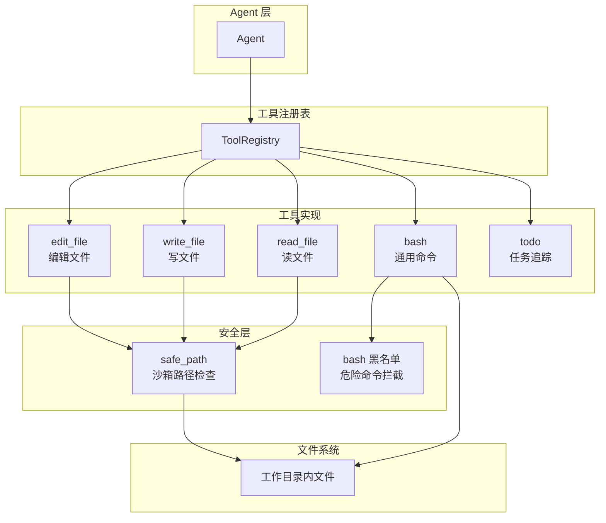
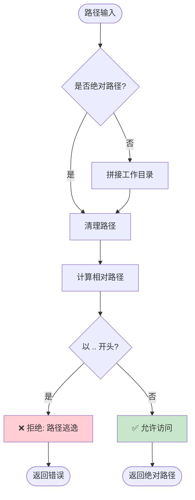
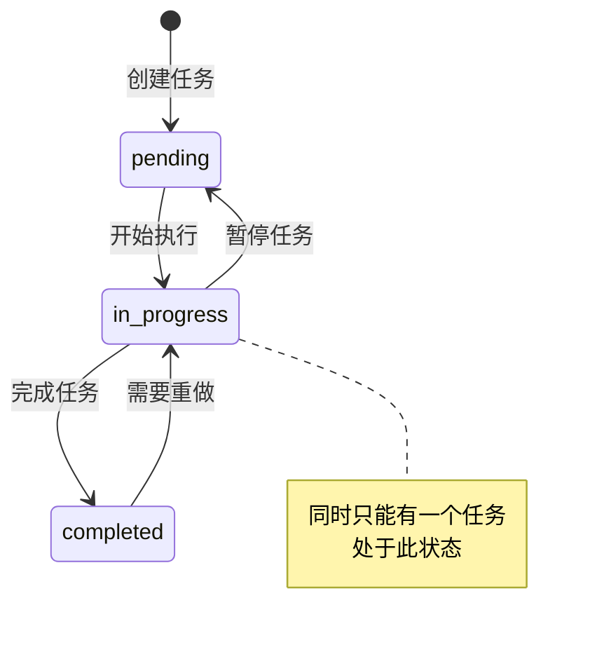
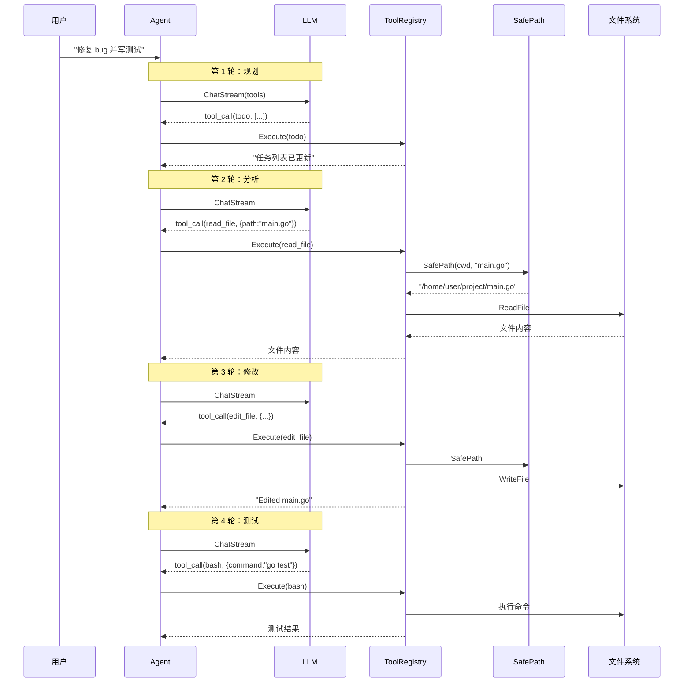

# Agent 循环与工具调用流程

> **项目**: ai_code (copilot)  
> **知识点**: Agent 循环与工具调用流程  
> **分类**: 核心业务逻辑  
> **分析日期**: 2026-03-27

---

## 目录

- [第一层：直觉建立](#第一层直觉建立)
- [第二层：概念框架](#第二层概念框架)
- [第三层：架构与设计](#第三层架构与设计)
- [第四层：实现深潜](#第四层实现深潜)
- [可视化图表](#可视化图表)
- [总结与延伸](#总结与延伸)

---

## 第一层：直觉建立

### 生活类比

Agent 循环就像**一个全能的程序员助手**，它有一个工具箱：

- **bash** - 终端命令，像手电筒照亮文件系统
- **read_file** - 读取文件，像打开书本
- **write_file** - 创建新文件，像写新文档
- **edit_file** - 编辑现有文件，像修改草稿
- **todo** - 任务清单，像便利贴记录进度
- **task** - 子智能体，像外包团队处理独立任务

当你给它一个任务："帮我修复这个 bug"，它会：

1. **规划** - 用 todo 记录需要做什么
2. **探索** - 用 bash 和 read_file 了解代码结构
3. **修改** - 用 edit_file 修改代码
4. **验证** - 用 bash 运行测试
5. **迭代** - 根据结果调整，直到完成

### 核心直觉

**为什么需要这么多工具？**

想象你要修房子：
- 只用一把锤子 → 效率低，很多事做不了
- 专用工具套装 → 钉钉子用锤子，拧螺丝用螺丝刀，各司其职

**工具划分的智慧**：
- `bash` = 通用工具，什么都能干，但容易出错
- `read_file/write_file/edit_file` = 文件专用工具，安全可控
- `todo` = 进度管理工具，防止 AI 迷失方向

---

## 第二层：概念框架

### 核心术语

| 术语 | 解释 |
|------|------|
| **Tool Interface** | 工具统一接口：Name、Description、Parameters、Execute |
| **Safe Path** | 沙箱路径，限制工具只能在工作目录内操作 |
| **Todo List** | 任务列表，追踪多步骤任务的进度 |
| **Tool Registry** | 工具注册表，管理所有可用工具 |

### 工具划分设计

```
┌─────────────────────────────────────────────────────────────┐
│                        工具体系                              │
├─────────────────────────────────────────────────────────────┤
│  执行类工具                     │  管理类工具               │
│  ├─ bash      (通用命令)         │  ├─ todo (任务追踪)       │
│  ├─ read_file (读文件)           │  └─ task (子智能体)       │
│  ├─ write_file(写文件)           │                          │
│  └─ edit_file (编辑文件)         │                          │
├─────────────────────────────────────────────────────────────┤
│  安全机制：safe_path 沙箱路径检查                            │
└─────────────────────────────────────────────────────────────┘
```

### 设计目标

1. **让 LLM 能够操作文件系统** - 读取、创建、编辑文件
2. **安全可控** - 限制操作范围，防止误操作
3. **任务追踪** - 多步骤任务进度可视化
4. **工具解耦** - 每个工具职责单一，易于扩展

---

## 第三层：架构与设计

### 工具划分详解

#### 为什么要区分 read_file / write_file / edit_file？

**问题背景**：为什么不直接用 bash 的 `cat`、`echo`、`sed`？

| 方案 | 优点 | 缺点 |
|------|------|------|
| **全部用 bash** | 简单 | 危险命令难拦截、路径无检查、无语义理解 |
| **专用文件工具** | 语义明确、安全可控、输出友好 | 需要额外实现 |

**本项目选择**：专用文件工具 + bash 互补

**核心原因**：

1. **安全性**
   - `rm -rf /` 这样的危险命令，bash 工具有黑名单检查
   - 但 `echo "..." > /etc/passwd` 这种隐蔽操作，bash 很难拦截
   - 专用文件工具通过 `safe_path` 强制限制在工作目录内

2. **语义清晰**
   - LLM 理解 `read_file(path)` 比 `cat path` 更准确
   - 工具描述告诉 LLM 每个工具的用途和限制
   - 减少误用和错误尝试

3. **输出友好**
   - `read_file` 自动截断过长输出（50000 字符限制）
   - 支持 `limit` 参数分页读取大文件
   - 输出格式统一，便于 LLM 解析

4. **原子操作**
   - `edit_file` 精确替换，不会误改其他内容
   - `write_file` 自动创建父目录
   - 错误信息明确，便于 LLM 理解失败原因

### 工具对比分析

| 工具 | 职责 | 安全机制 | 典型场景 |
|------|------|---------|---------|
| **bash** | 执行任意 shell 命令 | 危险命令黑名单 | 运行测试、安装依赖、git 操作 |
| **read_file** | 读取文件内容 | safe_path + 输出截断 | 理解代码、查看配置 |
| **write_file** | 创建或覆盖文件 | safe_path + 自动创建目录 | 新建文件、生成代码 |
| **edit_file** | 精确替换文本 | safe_path + 必须匹配 | 修改现有代码 |
| **todo** | 任务列表管理 | 数量限制 + 状态校验 | 多步骤任务追踪 |
| **task** | 启动子智能体 | 工具过滤（防递归） | 上下文隔离的任务分解 |

### safe_path 沙箱机制

#### 为什么需要沙箱路径？

**安全威胁**：

```
用户工作目录: /home/user/project

LLM 尝试读取: /etc/passwd
LLM 尝试写入: ~/.ssh/authorized_keys
LLM 尝试删除: /usr/bin/*
```

这些操作如果用 bash 很难完全拦截，但专用文件工具可以通过 `safe_path` 统一防护。

#### 实现原理

```go
// internal/adapter/tool/safe_path.go:6-28
func SafePath(workDir, path string) (string, error) {
    // 1. 解析绝对路径
    absPath := path
    if !filepath.IsAbs(path) {
        absPath = filepath.Join(workDir, path)
    }

    // 2. 清理路径（处理 .. 等）
    absPath = filepath.Clean(absPath)

    // 3. 计算相对路径
    relPath, err := filepath.Rel(absWorkDir, absPath)
    if err != nil {
        return "", errors.New(errors.CodeInvalidInput, "invalid path")
    }

    // 4. 检查是否逃逸
    if len(relPath) >= 2 && relPath[:2] == ".." {
        return "", errors.New(errors.CodeInvalidInput, "path escapes workspace: "+path)
    }

    return absPath, nil
}
```

**防御效果**：

| 攻击路径 | 检测结果 | 防御效果 |
|---------|---------|---------|
| `/etc/passwd` | 绝对路径不在工作目录 | ❌ 拒绝 |
| `../../../etc/passwd` | 清理后路径逃逸 | ❌ 拒绝 |
| `./src/main.go` | 相对路径正常 | ✅ 允许 |
| `/home/user/project/config.yaml` | 在工作目录内 | ✅ 允许 |

### Todo 工具概述

Todo 工具用于追踪多步骤任务的进度，防止 LLM 在复杂任务中"迷失方向"。

**核心特性**：
- **状态管理**：pending → in_progress → completed
- **约束规则**：同时只能有一个 in_progress 任务
- **自动提醒**：连续 3 轮未使用时注入提醒

**详细实现参见**：[03-todo.md](03-todo.md)

---

## 第四层：实现深潜

### 工具接口统一设计

```go
// internal/port/tool.go:6-16
type Tool interface {
    Name() string                                  // 工具名称
    Description() string                           // 工具描述
    Parameters() map[string]interface{}            // 参数 JSON Schema
    Execute(ctx context.Context, args string) (string, error)  // 执行
}
```

**统一接口的好处**：

1. **注册表管理** - 所有工具通过 `ToolRegistry` 统一管理
2. **LLM 可发现** - `ToLLMTools()` 自动生成工具描述
3. **易于扩展** - 新工具只需实现 4 个方法

### read_file 实现

```go
// internal/adapter/tool/read_file.go:57-91
func (t *ReadFileTool) Execute(ctx context.Context, args string) (string, error) {
    // 1. 解析参数
    var params struct {
        Path  string `json:"path"`
        Limit *int   `json:"limit"`   // 可选：行数限制
    }
    json.Unmarshal([]byte(args), &params)

    // 2. 安全路径检查 ★
    safePath, err := SafePath(t.cwd, params.Path)
    if err != nil {
        return "", err
    }

    // 3. 读取文件
    content, err := os.ReadFile(safePath)
    if err != nil {
        return "", errors.Wrap(errors.CodeToolError, "failed to read file", err)
    }

    // 4. 行数限制处理
    if params.Limit != nil {
        lines := strings.Split(text, "\n")
        if *params.Limit < len(lines) {
            lines = lines[:*params.Limit]
            text = strings.Join(lines, "\n") + "\n... (more lines)"
        }
    }

    // 5. 输出截断
    if len(text) > 50000 {
        text = text[:50000] + "\n... (output truncated)"
    }

    return text, nil
}
```

**设计亮点**：
- 支持分页读取（limit 参数）
- 自动截断大文件
- 错误信息友好

### edit_file 实现

```go
// internal/adapter/tool/edit_file.go:57-91
func (t *EditFileTool) Execute(ctx context.Context, args string) (string, error) {
    var params struct {
        Path     string `json:"path"`
        OldText  string `json:"old_text"`   // 必须精确匹配
        NewText  string `json:"new_text"`
    }
    json.Unmarshal([]byte(args), &params)

    // 安全路径检查
    safePath, err := SafePath(t.cwd, params.Path)
    if err != nil {
        return "", err
    }

    // 读取文件
    content, _ := os.ReadFile(safePath)
    text := string(content)

    // 检查旧文本是否存在 ★
    if !strings.Contains(text, params.OldText) {
        return "", errors.New(errors.CodeToolError, "text not found in "+params.Path)
    }

    // 只替换第一个匹配 ★
    newText := strings.Replace(text, params.OldText, params.NewText, 1)

    // 写入文件
    os.WriteFile(safePath, []byte(newText), 0644)

    return "Edited " + params.Path, nil
}
```

**设计亮点**：
- 精确匹配，不会误改
- 只替换第一个匹配，防止批量误改
- 必须先找到才能替换

### write_file 实现

```go
// internal/adapter/tool/write_file.go:55-85
func (t *WriteFileTool) Execute(ctx context.Context, args string) (string, error) {
    var params struct {
        Path    string `json:"path"`
        Content string `json:"content"`
    }
    json.Unmarshal([]byte(args), &params)

    // 安全路径检查
    safePath, err := SafePath(t.cwd, params.Path)
    if err != nil {
        return "", err
    }

    // 自动创建父目录 ★
    dir := filepath.Dir(safePath)
    os.MkdirAll(dir, 0755)

    // 写入文件
    os.WriteFile(safePath, []byte(params.Content), 0644)

    return fmt.Sprintf("Wrote %d bytes to %s", len(params.Content), params.Path), nil
}
```

**设计亮点**：
- 自动创建父目录，无需预先 mkdir
- 覆盖已存在文件（语义明确）
- 返回写入字节数，便于确认

### write_file 实现

### 工具体系架构图



### safe_path 检查流程



### Todo 状态流转图



### Agent 与工具交互序列图



---

## 总结与延伸

### 核心要点

1. **工具分层设计**
   - 执行类：bash、read_file、write_file、edit_file
   - 管理类：todo 任务追踪

2. **文件工具 vs bash**
   - 文件工具：语义明确、安全可控、输出友好
   - bash：通用灵活、但有安全风险

3. **safe_path 沙箱**
   - 路径逃逸检测
   - 工作目录边界保护
   - 统一应用于所有文件工具

4. **Todo 流程**
   - 强制 LLM 规划任务
   - 进度可视化追踪
   - 连续未使用自动提醒

### 设计亮点

| 设计 | 解决的问题 | 实现方式 |
|------|-----------|---------|
| 文件工具分离 | bash 操作文件不安全 | read/write/edit 三工具 |
| safe_path | 路径逃逸攻击 | 相对路径检查 |
| todo 工具 | LLM 迷失方向 | 任务状态机 + 提醒注入 |
| 输出截断 | 大文件响应过慢 | 50000 字符限制 |

### 设计局限

| 局限 | 原因 | 可能改进 |
|------|------|---------|
| bash 黑名单不完整 | 无法枚举所有危险命令 | 白名单模式 |
| todo 不持久化 | 内存存储 | 文件/数据库存储 |
| 无工具权限分级 | 所有工具同等权限 | 用户授权机制 |

### 面试高频题

1. **Q: 为什么不直接用 bash 的 cat/echo/sed 操作文件？**
   A: 安全性和语义清晰度。专用文件工具通过 safe_path 限制操作范围，避免路径逃逸攻击；工具描述让 LLM 更准确理解用途，减少误用。

2. **Q: safe_path 如何防止路径逃逸？**
   A: 三步检查：解析绝对路径 → 清理路径（处理 ..）→ 计算相对路径。如果相对路径以 .. 开头，说明目标在工作目录之外，拒绝访问。

3. **Q: Todo 工具为什么限制只能有一个 in_progress？**
   A: 强制 LLM 串行处理任务，避免同时做多件事导致混乱。符合人类工作习惯，也便于用户追踪当前进度。

### 学习路径

1. **前置阅读**：工具注册表、Agent 循环基础
2. **相关源码**：
   - `internal/adapter/tool/read_file.go` - 文件读取
   - `internal/adapter/tool/write_file.go` - 文件写入
   - `internal/adapter/tool/edit_file.go` - 文件编辑
   - `internal/adapter/tool/safe_path.go` - 路径安全
   - `internal/adapter/tool/todo.go` - 任务管理
3. **延伸阅读**：
   - [OpenAI Function Calling 安全最佳实践](https://platform.openai.com/docs/guides/function-calling)
   - [ReAct: Reasoning + Acting](https://arxiv.org/abs/2210.03629)