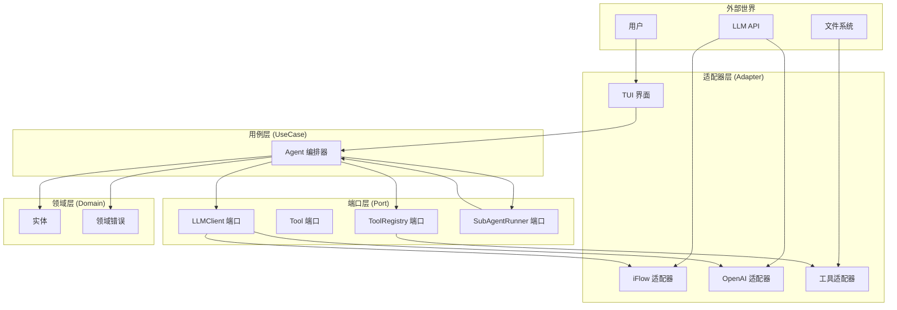
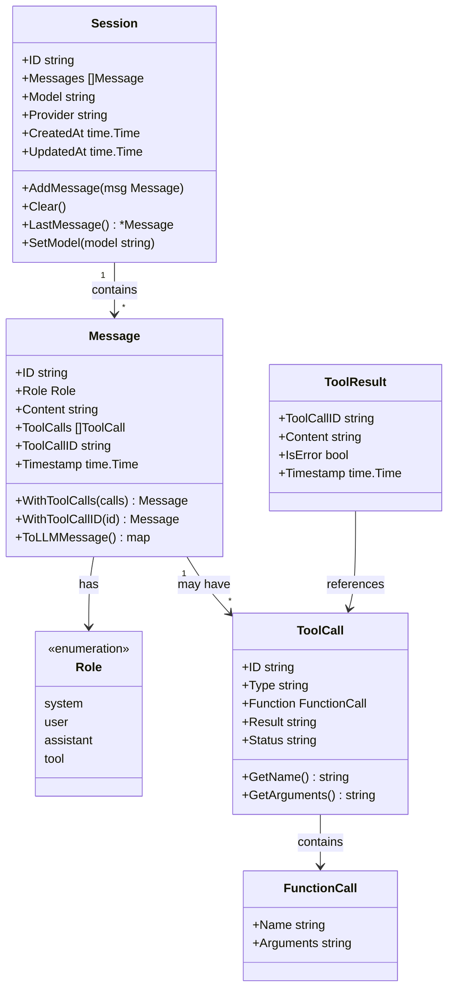
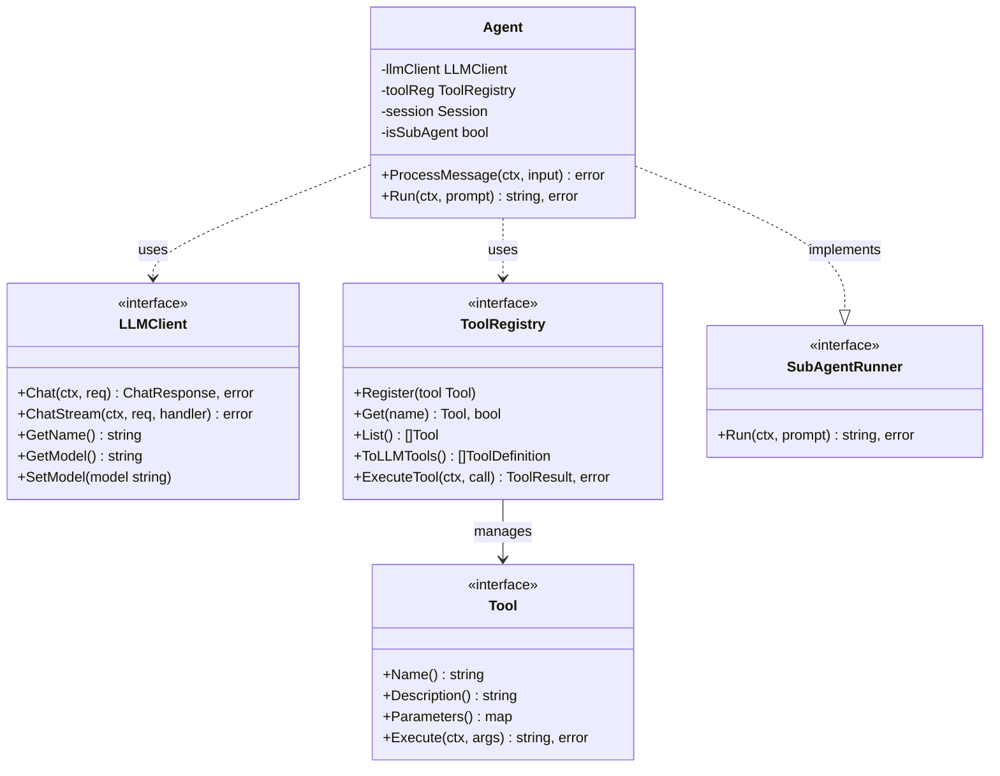
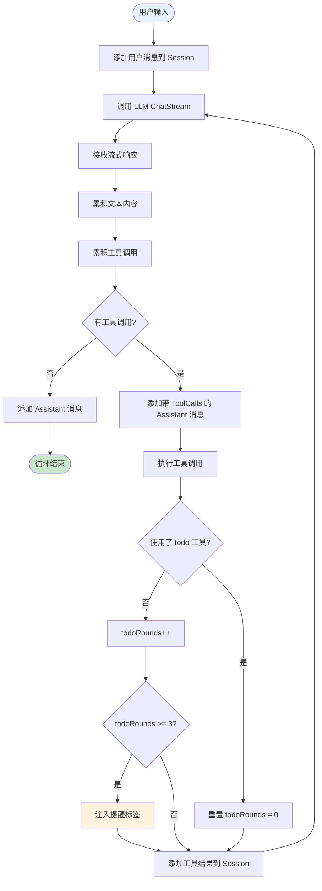
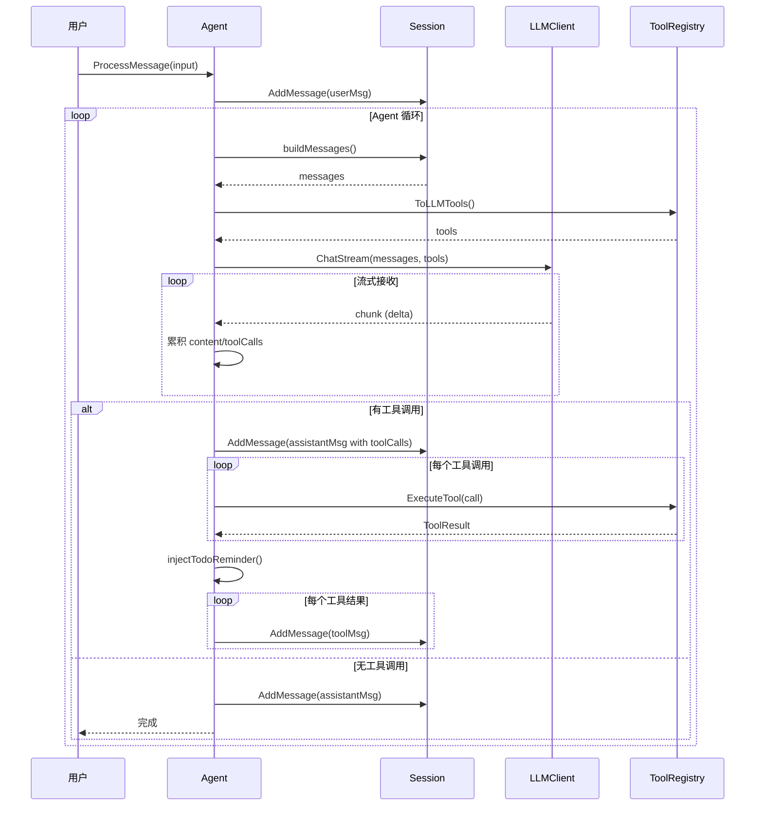
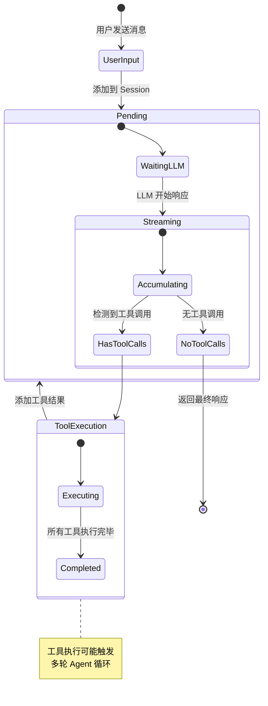
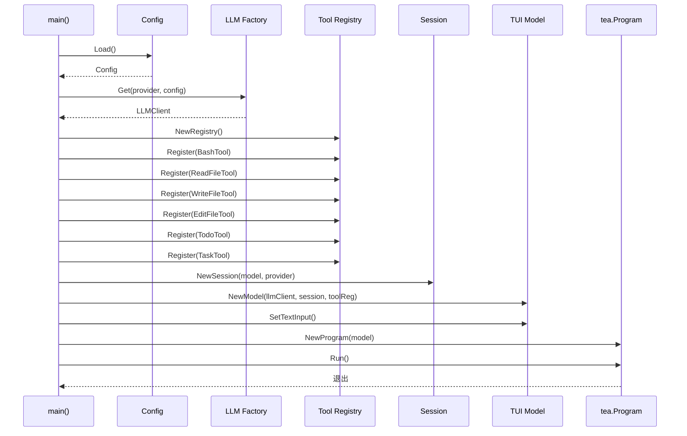
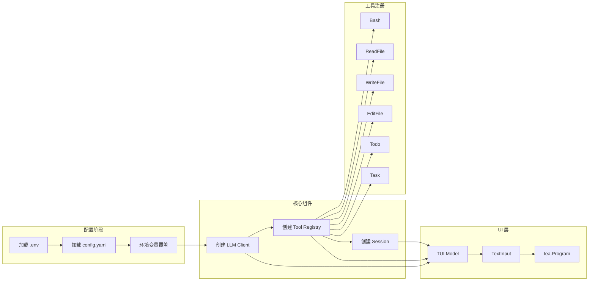
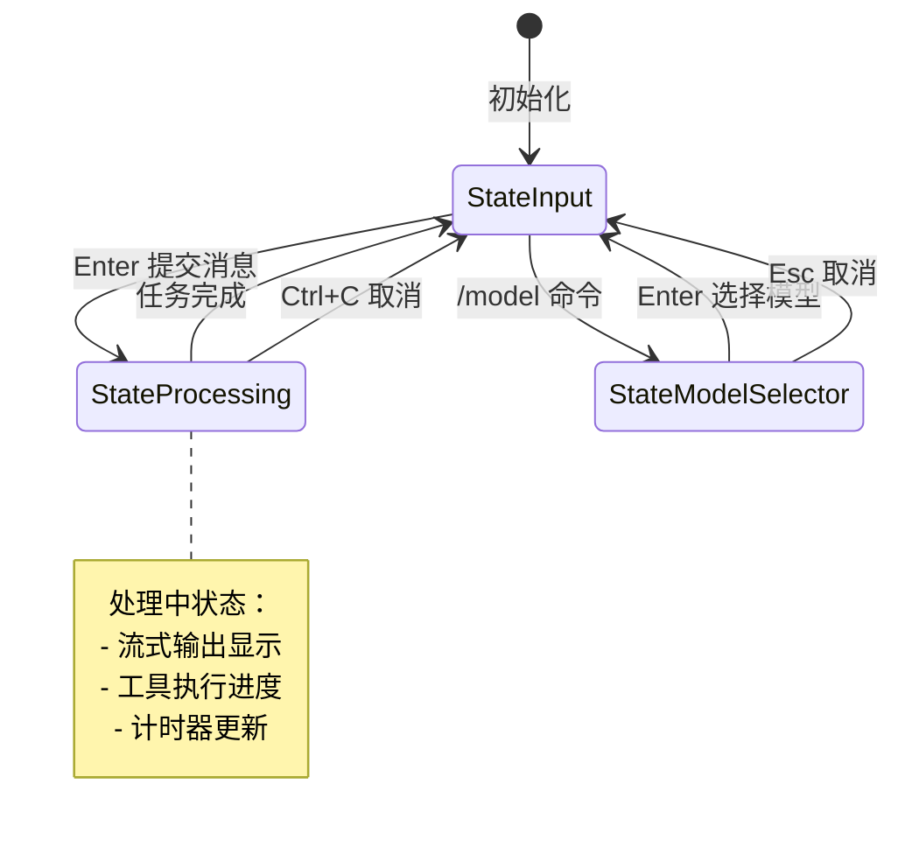
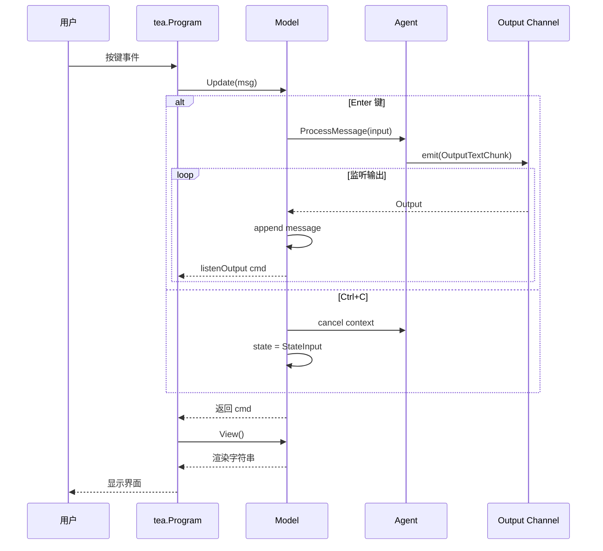

# 架构与核心设计

> **项目**: ai_code (copilot)  
> **分析日期**: 2026-03-30

---

## 一、整体架构

### 1.1 六边形架构概览

项目采用**六边形架构（端口-适配器模式）**，将核心业务逻辑与外部依赖解耦。



### 1.2 分层职责

| 层级 | 目录 | 职责 | 依赖方向 |
|------|------|------|---------|
| **领域层** | `internal/domain/` | 定义实体和领域错误 | 无外部依赖 |
| **端口层** | `internal/port/` | 定义接口契约 | 依赖领域层 |
| **用例层** | `internal/usecase/` | 编排业务逻辑 | 依赖端口层 |
| **适配器层** | `internal/adapter/` | 实现具体技术 | 依赖端口层 |

### 1.3 目录结构映射

```
internal/
├── domain/                    # 领域层：核心业务概念
│   ├── entity/               # 实体定义
│   │   ├── session.go        # 会话实体
│   │   ├── message.go        # 消息实体
│   │   ├── tool.go           # 工具调用实体
│   │   └── id.go             # ID 生成
│   └── errors/               # 领域错误
│       └── errors.go
│
├── port/                      # 端口层：接口契约
│   ├── llm.go                # LLM 客户端接口
│   ├── tool.go               # 工具接口
│   └── subagent.go           # 子智能体接口
│
├── usecase/                   # 用例层：业务编排
│   └── agent.go              # Agent 核心逻辑
│
└── adapter/                   # 适配器层：技术实现
    ├── llm/                   # LLM 适配器
    │   ├── base.go           # 基础客户端
    │   ├── factory.go        # 工厂注册表
    │   ├── iflow.go          # iFlow 实现
    │   └── openai.go         # OpenAI 实现
    ├── tool/                  # 工具适配器
    │   ├── registry.go       # 工具注册表
    │   ├── bash.go           # Bash 工具
    │   ├── read_file.go      # 文件读取
    │   ├── write_file.go     # 文件写入
    │   ├── edit_file.go      # 文件编辑
    │   ├── todo.go           # Todo 工具
    │   └── task.go           # Task 工具
    └── ui/tui/                # UI 适配器
        ├── model.go          # 状态模型
        ├── update.go         # 事件处理
        └── view.go           # 视图渲染
```

---

## 二、核心实体关系

### 2.1 领域实体类图



### 2.2 实体职责说明

| 实体 | 职责 | 生命周期 |
|------|------|---------|
| **Session** | 管理对话历史和模型配置 | 整个会话期间 |
| **Message** | 封装单条消息（用户/助手/工具） | 创建后不可变 |
| **ToolCall** | 表示 LLM 发起的工具调用请求 | 随消息存在 |
| **ToolResult** | 表示工具执行结果 | 随工具调用产生 |

---

## 三、端口接口设计

### 3.1 端口接口关系图



### 3.2 接口契约说明

| 接口 | 方法 | 说明 |
|------|------|------|
| **LLMClient** | `Chat()` | 非流式对话 |
| | `ChatStream()` | 流式对话 |
| | `GetModel()/SetModel()` | 模型切换 |
| **Tool** | `Name()` | 工具标识 |
| | `Parameters()` | JSON Schema 参数定义 |
| | `Execute()` | 执行工具逻辑 |
| **ToolRegistry** | `Register()` | 注册工具 |
| | `ToLLMTools()` | 生成 LLM 可识别的工具定义 |
| | `ExecuteTool()` | 根据调用执行工具 |
| **SubAgentRunner** | `Run()` | 执行子任务并返回摘要 |

---

## 四、核心流程

### 4.1 Agent 循环流程图

Agent 循环是整个系统的核心执行模型。



### 4.2 Agent 循环序列图



### 4.3 消息状态流转



---

## 五、启动流程

### 5.1 应用启动序列图



### 5.2 组件初始化顺序



---

## 六、TUI 架构

### 6.1 TUI 状态机

TUI 基于 Bubble Tea 框架实现，采用 Elm 架构。



### 6.2 TUI 事件流



---

## 七、设计亮点总结

| 设计点 | 实现方式 | 优势 |
|--------|---------|------|
| **六边形架构** | Port + Adapter 分层 | 核心逻辑与技术解耦，易于测试 |
| **工厂模式** | LLM 注册表 | 支持多提供商，扩展性强 |
| **工具注册表** | 统一 Tool 接口 | 工具可插拔，LLM 可发现 |
| **流式响应** | SSE + StreamHandler | 实时输出，用户体验好 |
| **上下文隔离** | 独立 Session + Task 工具 | 子 Agent 上下文干净 |
| **Elm 架构** | Bubble Tea TUI | 状态管理清晰，事件驱动 |
