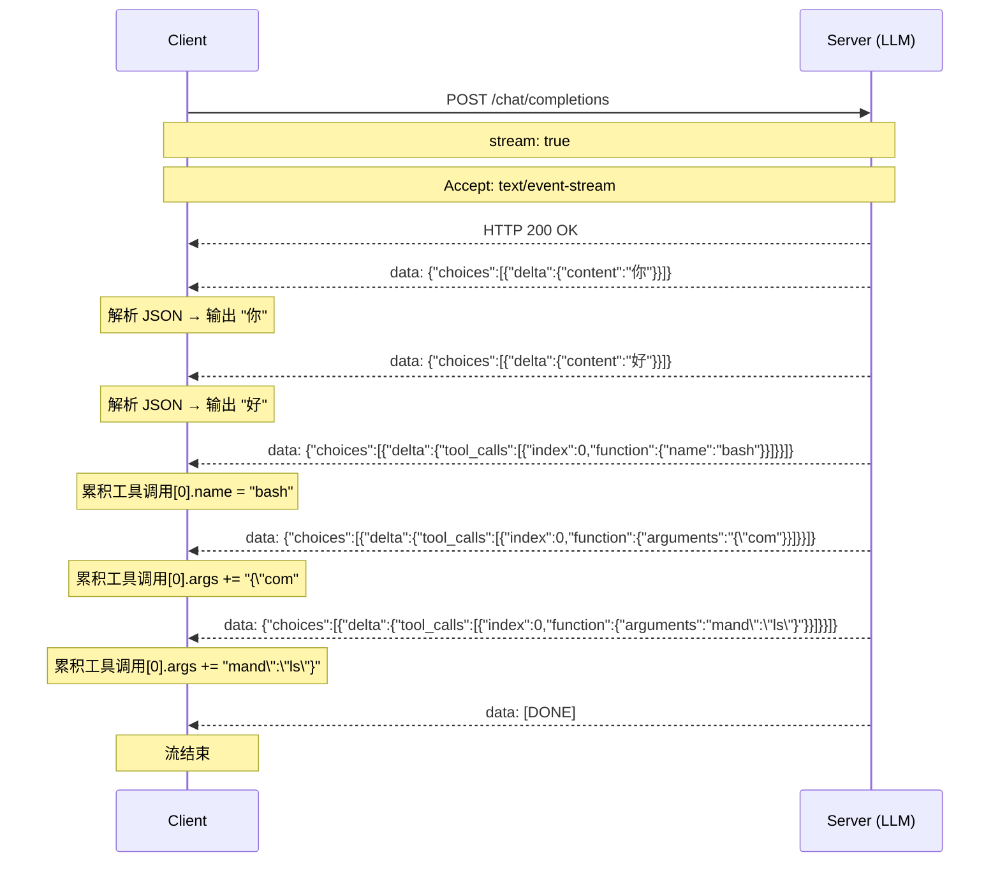
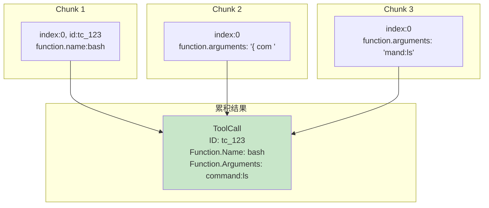
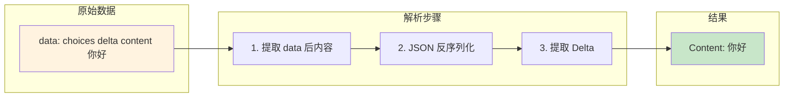
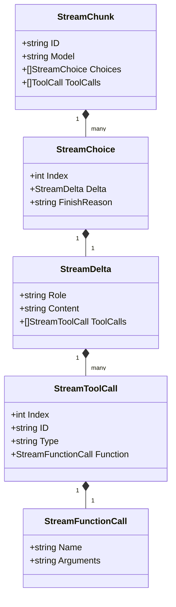

# SSE 流式响应处理

> **项目**: ai_code (copilot)  
> **知识点**: SSE 流式响应处理  
> **分类**: LLM 通信层  
> **分析日期**: 2026-03-27

---

## 目录

- [第一层：直觉建立](#第一层直觉建立)
- [第二层：概念框架](#第二层概念框架)
- [第三层：架构与设计](#第三层架构与设计)
- [第四层：实现深潜](#第四层实现深潜)
- [可视化图表](#可视化图表)
- [总结与延伸](#总结与延伸)

---

## 第一层：直觉建立

### 生活类比

SSE 流式响应就像**听电台广播**。

传统 API 调用像下载一首完整的歌：你必须等整首歌下载完才能播放。

SSE 流式响应像收音机直播：主持人说一句，你立刻听到一句，不需要等整段话说完。

**在 LLM 场景中**：

- **非流式**：LLM 生成 500 字回答，你等 10 秒后一次性看到全部内容
- **流式**：LLM 生成一个字，你立刻看到一个字，边生成边显示

### 核心直觉

流式响应解决了两个问题：

1. **用户体验**：用户立即看到 AI 开始"思考"，不用干等
2. **工具调用**：工具调用参数可能很长，分片传输更高效

---

## 第二层：概念框架

### 核心术语

| 术语 | 解释 |
|------|------|
| **SSE** | Server-Sent Events，服务器推送事件协议 |
| **Chunk** | 流式响应的单个数据块 |
| **Delta** | 增量内容，chunk 中的变化部分 |
| **Tool Call Index** | 工具调用的索引，用于标识多个并发工具调用 |

### SSE 协议格式

```
data: {"id":"chatcmpl-123","choices":[{"delta":{"content":"你好"}}]}

data: {"id":"chatcmpl-123","choices":[{"delta":{"content":"，我是"}}]}

data: {"id":"chatcmpl-123","choices":[{"delta":{"content":"AI助手"}}]}

data: [DONE]
```

**关键特点**：
- 每行以 `data: ` 开头
- JSON 格式的 chunk
- `[DONE]` 标记流结束

### 设计目标

1. **实时输出**：文本内容立即显示，不等待完整响应
2. **增量累积**：工具调用参数分片到达，需要正确拼接
3. **多提供商兼容**：OpenAI 和 iFlow 格式略有不同
4. **错误恢复**：单个 chunk 解析失败不影响整体流程

### 在系统中的位置

```
Agent
  │
  └─→ LLMClient.ChatStream()
        │
        ├─→ HTTP POST (stream=true)
        │
        └─→ SSE Response Body
              │
              ├─→ parseStreamResponse()
              │     │
              │     └─→ handler(chunk)
              │
              └─→ StreamChunk
                    │
                    ├─→ Delta.Content     → 实时输出
                    └─→ Delta.ToolCalls   → 累积工具调用
```

---

## 第三层：架构与设计

### 架构决策

#### 为什么选择 SSE 而非 WebSocket？

| 方案 | 优点 | 缺点 |
|------|------|------|
| **SSE** | 简单、HTTP 原生支持、自动重连 | 单向传输 |
| **WebSocket** | 双向通信、更低延迟 | 复杂、需要额外基础设施 |

**本项目选择**：SSE

**原因**：
- LLM 流式输出是单向的（服务器→客户端）
- OpenAI API 标准使用 SSE
- 实现简单，兼容性好

### 核心数据结构

#### StreamChunk 流式响应块

```go
// internal/port/llm.go:71-81
type StreamChunk struct {
    ID      string          `json:"id"`
    Object  string          `json:"object"`
    Created int64           `json:"created"`
    Model   string          `json:"model"`
    Choices []StreamChoice  `json:"choices"`
    Usage   *Usage          `json:"usage,omitempty"`
    
    // iFlow 兼容：根级别的 tool_calls
    ToolCalls []entity.ToolCall `json:"tool_calls,omitempty"`
}
```

#### StreamChoice 选择项

```go
// internal/port/llm.go:86-90
type StreamChoice struct {
    Index        int          `json:"index"`
    Delta        StreamDelta  `json:"delta"`         // 增量内容
    FinishReason string       `json:"finish_reason"` // stop/tool_calls
}
```

#### StreamDelta 增量内容

```go
// internal/port/llm.go:94-98
type StreamDelta struct {
    Role      string           `json:"role,omitempty"`
    Content   string           `json:"content,omitempty"`
    ToolCalls []StreamToolCall `json:"tool_calls,omitempty"`
}
```

#### StreamToolCall 流式工具调用

```go
// internal/port/llm.go:102-109
type StreamToolCall struct {
    Index    int                `json:"index"`     // 关键：标识第几个工具调用
    ID       string             `json:"id"`
    Type     string             `json:"type"`
    Function StreamFunctionCall `json:"function"`
}

type StreamFunctionCall struct {
    Name      string `json:"name"`      // 工具名
    Arguments string `json:"arguments"` // 参数（增量累积）
}
```

### 核心流程

#### 流式请求发送

```go
// internal/adapter/llm/base.go:135-160
func (c *BaseClient) ChatStream(ctx context.Context, req *port.ChatRequest, handler port.StreamHandler) error {
    req.Stream = true  // 强制流式
    
    llmReq := c.buildLLMRequest(req)
    body, _ := json.Marshal(llmReq)

    httpReq, _ := http.NewRequestWithContext(ctx, "POST", c.baseURL, bytes.NewReader(body))
    c.setHeaders(httpReq)
    httpReq.Header.Set("Accept", "text/event-stream")  // 关键：接受 SSE

    resp, _ := c.client.Do(httpReq)
    defer resp.Body.Close()

    return c.parseStreamResponse(resp.Body, handler)
}
```

#### SSE 流解析

```go
// internal/adapter/llm/base.go:162-220
func (c *BaseClient) parseStreamResponse(reader io.Reader, handler port.StreamHandler) error {
    scanner := bufio.NewScanner(reader)
    collector := newStreamResponseCollector()

    for scanner.Scan() {
        line := scanner.Text()
        
        // 跳过空行
        if line == "" {
            continue
        }

        // 解析 "data: {...}" 格式
        var data string
        if strings.HasPrefix(line, "data: ") {
            data = strings.TrimPrefix(line, "data: ")
        } else if strings.HasPrefix(line, "data:") {
            data = strings.TrimPrefix(line, "data:")
        } else {
            continue
        }

        // 流结束标记
        if data == "[DONE]" {
            break
        }

        // 解析 JSON chunk
        var chunk port.StreamChunk
        if err := json.Unmarshal([]byte(data), &chunk); err != nil {
            c.logger.Warn("failed to parse chunk", logger.F("data", data))
            continue  // 单个 chunk 失败不影响整体
        }

        // 收集响应（用于日志）
        collector.Collect(&chunk)

        // 调用 handler 处理
        if err := handler(&chunk); err != nil {
            return err
        }
    }

    return scanner.Err()
}
```

### 模块交互

```
HTTP Response Body
       │
       ▼
┌──────────────────────┐
│   bufio.Scanner      │  逐行读取
└──────────────────────┘
       │
       ▼
┌──────────────────────┐
│   解析 "data: {...}"  │  提取 JSON
└──────────────────────┘
       │
       ▼
┌──────────────────────┐
│   json.Unmarshal     │  反序列化
└──────────────────────┘
       │
       ├────────────────────┐
       ▼                    ▼
┌──────────────┐   ┌────────────────────┐
│   handler()  │   │  collector.Collect │
│   业务处理    │   │  日志收集           │
└──────────────┘   └────────────────────┘
```

---

## 第四层：实现深潜

### 关键算法：工具调用增量累积

```go
// internal/usecase/agent.go:140-162
var toolCallsMap = make(map[int]*entity.ToolCall)  // 按 index 存储

err := a.llmClient.ChatStream(ctx, req, func(chunk *port.StreamChunk) error {
    for _, tc := range chunk.Choices[0].Delta.ToolCalls {
        idx := tc.Index

        // 初始化（如果不存在）
        if toolCallsMap[idx] == nil {
            toolCallsMap[idx] = &entity.ToolCall{
                Type:     "function",
                Function: entity.FunctionCall{},
            }
        }

        existing := toolCallsMap[idx]

        // 增量更新非空字段
        if tc.ID != "" {
            existing.ID = tc.ID
        }
        if tc.Function.Name != "" {
            existing.Function.Name = tc.Function.Name
        }
        if tc.Function.Arguments != "" {
            existing.Function.Arguments += tc.Function.Arguments  // 拼接！
        }
    }
    return nil
})
```

**关键技术点**：

1. **Index 作为 Key**：多个工具调用通过 index 区分
2. **增量拼接**：`Arguments += tc.Function.Arguments`，参数分片到达
3. **非空判断**：只有非空字段才更新

### 关键算法：流式响应收集器

```go
// internal/adapter/llm/base.go:222-300
type streamResponseCollector struct {
    id           string
    model        string
    content      strings.Builder   // 文本累积
    toolCalls    []map[string]any  // 工具调用累积
    finishReason string
    chunkCount   int
}

func (c *streamResponseCollector) Collect(chunk *port.StreamChunk) {
    c.chunkCount++

    // 收集基本信息
    if chunk.ID != "" {
        c.id = chunk.ID
    }
    if chunk.Model != "" {
        c.model = chunk.Model
    }

    choice := chunk.Choices[0]

    // 累积文本内容
    if choice.Delta.Content != "" {
        c.content.WriteString(choice.Delta.Content)
    }

    // 累积工具调用
    for _, tc := range choice.Delta.ToolCalls {
        c.collectToolCall(tc)
    }
}

func (c *streamResponseCollector) collectToolCall(tc port.StreamToolCall) {
    idx := tc.Index

    // 扩展切片
    for len(c.toolCalls) <= idx {
        c.toolCalls = append(c.toolCalls, map[string]any{
            "id":   "",
            "type": "function",
            "function": map[string]any{"name": "", "arguments": ""},
        })
    }

    // 更新字段
    if tc.ID != "" {
        c.toolCalls[idx]["id"] = tc.ID
    }
    if tc.Type != "" {
        c.toolCalls[idx]["type"] = tc.Type
    }

    fnMap := c.toolCalls[idx]["function"].(map[string]any)
    if tc.Function.Name != "" {
        fnMap["name"] = tc.Function.Name
    }
    if tc.Function.Arguments != "" {
        args := fnMap["arguments"].(string)
        fnMap["arguments"] = args + tc.Function.Arguments
    }
}
```

**用途**：收集完整响应用于日志记录，便于调试。

### 关键算法：多提供商兼容

#### iFlow 特殊处理

```go
// internal/adapter/llm/base.go:115-121
func (c *BaseClient) parseResponse(body []byte) (*port.ChatResponse, error) {
    var resp port.ChatResponse
    json.Unmarshal(body, &resp)

    // iFlow 兼容：将根级别的 ToolCalls 合并到 message 中
    if len(resp.ToolCalls) > 0 && len(resp.Choices) > 0 {
        resp.Choices[0].Message.ToolCalls = resp.ToolCalls
    }

    return &resp, nil
}
```

**差异说明**：

| 字段位置 | OpenAI 格式 | iFlow 格式 |
|---------|------------|-----------|
| ToolCalls | `choices[0].message.tool_calls` | 根级别 `tool_calls` |

### 性能设计

1. **bufio.Scanner**：高效逐行读取，避免内存溢出
2. **strings.Builder**：高效的字符串拼接
3. **按需分配**：工具调用切片动态扩展

### 边界处理

#### 1. SSE 格式兼容（有无空格）

```go
// internal/adapter/llm/base.go:184-192
var data string
if strings.HasPrefix(line, "data: ") {   // 标准格式 "data: "
    data = strings.TrimPrefix(line, "data: ")
} else if strings.HasPrefix(line, "data:") {  // 兼容 "data:"
    data = strings.TrimPrefix(line, "data:")
}
```

#### 2. JSON 解析失败处理

```go
// internal/adapter/llm/base.go:198-201
if err := json.Unmarshal([]byte(data), &chunk); err != nil {
    c.logger.Warn("failed to parse chunk", logger.F("data", data))
    continue  // 不中断流程
}
```

#### 3. 空行跳过

```go
// internal/adapter/llm/base.go:180-182
if line == "" {
    continue
}
```

---

## 可视化图表

### SSE 流传输时序图



### 工具调用累积流程



### 数据结构解析流程



### 类图：流式响应相关结构



---

## 总结与延伸

### 核心要点

1. **SSE 协议**：`data: {...}` 格式，`[DONE]` 结束标记
2. **增量解析**：每行独立解析为 StreamChunk
3. **工具调用累积**：通过 index 标识，参数增量拼接
4. **多提供商兼容**：处理 OpenAI 和 iFlow 的格式差异
5. **错误容忍**：单个 chunk 解析失败不中断整体流程

### 设计亮点

| 亮点 | 说明 |
|------|------|
| **兼容性** | 支持 `data: ` 和 `data:` 两种格式 |
| **增量累积** | 正确处理工具调用参数的分片传输 |
| **日志收集** | collector 收集完整响应用于调试 |
| **优雅降级** | JSON 解析失败时跳过而非报错 |

### 设计局限

| 局限 | 原因 | 可能改进 |
|------|------|---------|
| 无背压控制 | 简单实现 | 可添加 buffer 和速率限制 |
| 无断点续传 | SSE 无状态 | 可记录已接收 chunk |
| 单线程处理 | Go bufio.Scanner | 可用更高效的事件循环 |

### 常见误区

1. **误区**：工具调用参数一次性传输
   **正确**：参数可能分多个 chunk 发送，必须增量累积

2. **误区**：所有 chunk 都包含 content 或 tool_calls
   **正确**：有些 chunk 可能只有 role 或为空

3. **误区**：index 从 0 连续递增
   **正确**：index 可能不连续，应该用 map 存储

### 面试高频题

1. **Q: SSE 和 WebSocket 有什么区别？**
   A: SSE 是单向的 HTTP 长连接，适合服务器推送；WebSocket 是双向的独立协议，适合实时双向通信。LLM 流式输出是单向的，SSE 更简单合适。

2. **Q: 如何处理工具调用参数的分片传输？**
   A: 使用 map[int]*ToolCall 按 index 存储，每次收到 chunk 时增量更新非空字段，参数使用 `+=` 拼接。

3. **Q: 流式传输中如何保证数据完整性？**
   A: 依赖 TCP 保证数据有序可靠到达，应用层通过 `[DONE]` 标记判断流结束。

### 学习路径

1. **前置阅读**：HTTP 协议、JSON 解析
2. **相关源码**：
   - `internal/adapter/llm/base.go` - 流式处理核心
   - `internal/port/llm.go` - 数据结构定义
   - `internal/usecase/agent.go` - 流式调用使用
3. **延伸阅读**：
   - [MDN: Server-sent events](https://developer.mozilla.org/en-US/docs/Web/API/Server-sent_events)
   - [OpenAI Streaming API](https://platform.openai.com/docs/api-reference/streaming)
   - [SSE vs WebSocket 对比](https://ably.com/blog/websockets-vs-sse)
