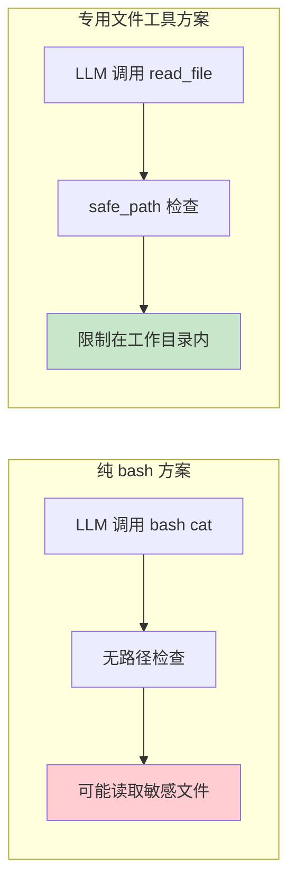
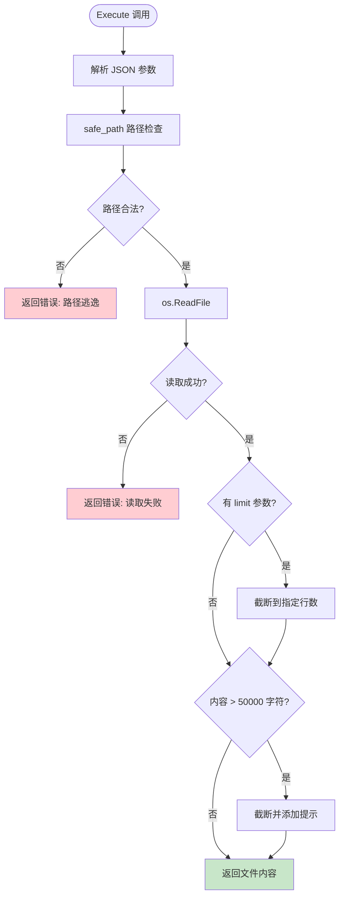
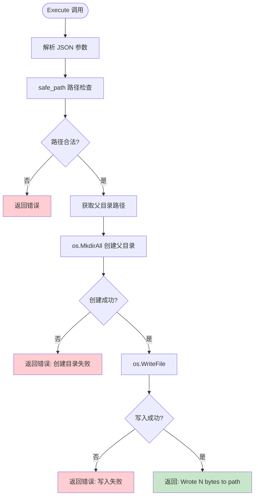
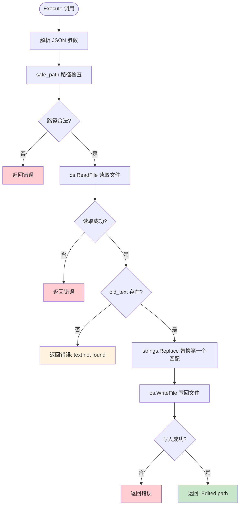
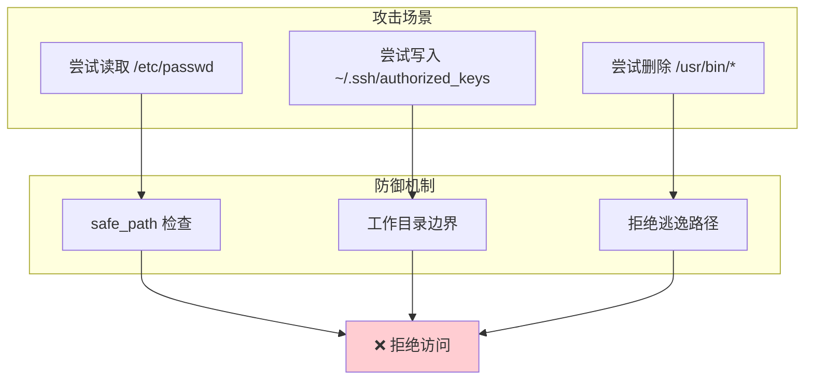
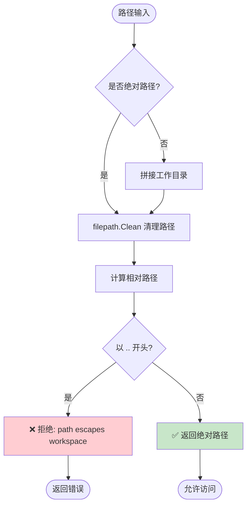
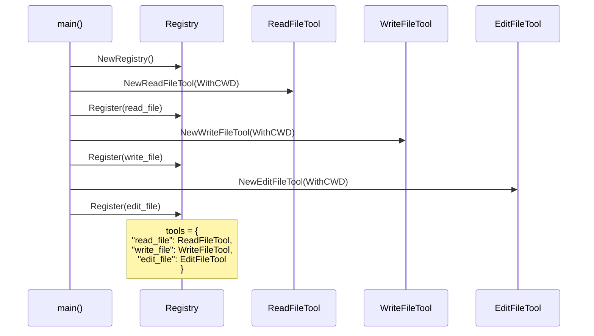
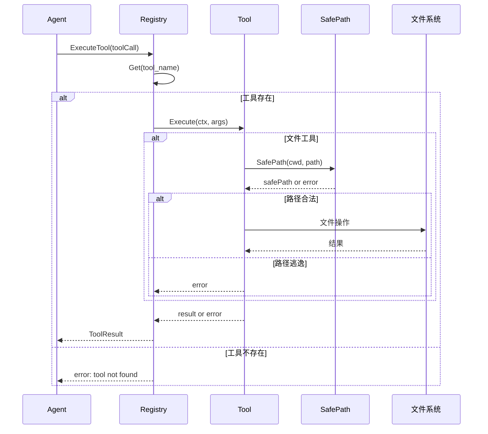
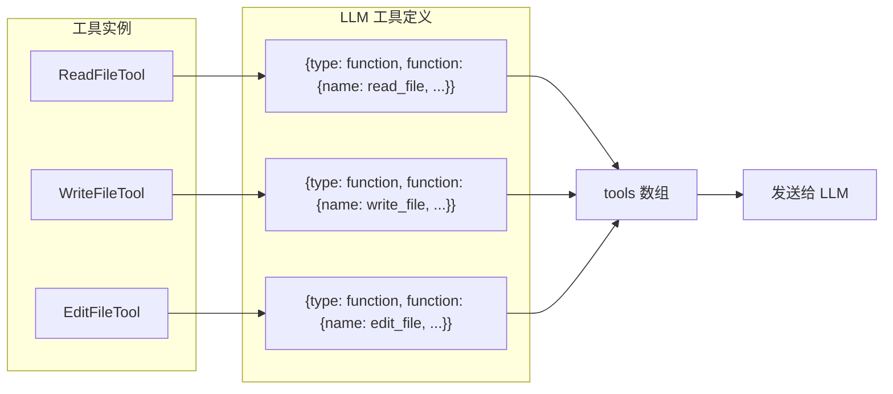
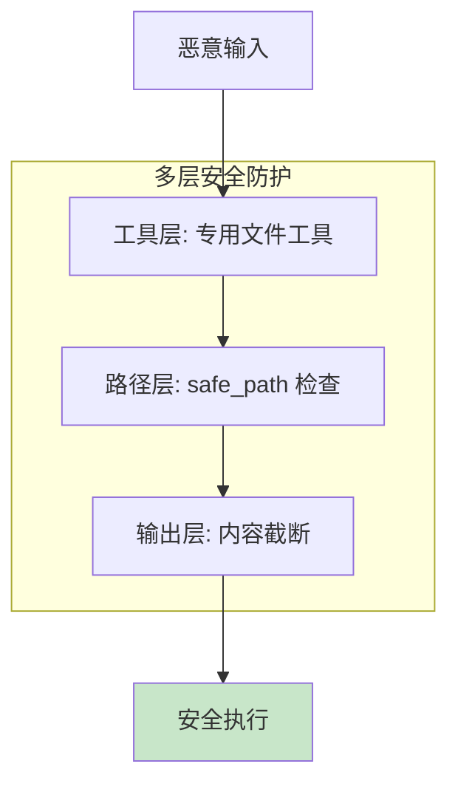

# 文件工具实现

> **项目**: ai_code (copilot)  
> **分析日期**: 2026-03-30

---

## 一、文件工具概览

### 1.1 工具分类

项目提供三个专用文件工具，用于安全地操作文件系统：

| 工具 | 职责 | 典型场景 |
|------|------|---------|
| **read_file** | 读取文件内容 | 理解代码、查看配置 |
| **write_file** | 创建或覆盖文件 | 新建文件、生成代码 |
| **edit_file** | 精确替换文本 | 修改现有代码 |

### 1.2 为什么需要专用文件工具

**问题**：为什么不直接用 bash 的 `cat`、`echo`、`sed`？



**专用文件工具优势**：

| 方面 | bash 方案 | 专用文件工具 |
|------|----------|-------------|
| **安全性** | 危险命令难拦截 | safe_path 强制限制 |
| **语义清晰** | LLM 理解困难 | 工具描述明确 |
| **输出友好** | 原始输出 | 自动截断、分页 |
| **原子操作** | 可能误改 | 精确匹配替换 |

---

## 二、工具接口设计

### 2.1 Tool 接口

所有工具实现统一的 `Tool` 接口：

```mermaid
classDiagram
    class Tool {
        <<interface>>
        +Name() string
        +Description() string
        +Parameters() map[string]interface{}
        +Execute(ctx context.Context, args string) string, error
    }
    
    class ReadFileTool {
        -cwd string
        -logger Logger
        +Name() string
        +Description() string
        +Parameters() map
        +Execute(ctx, args) string, error
    }
    
    class WriteFileTool {
        -cwd string
        -logger Logger
        +Name() string
        +Description() string
        +Parameters() map
        +Execute(ctx, args) string, error
    }
    
    class EditFileTool {
        -cwd string
        -logger Logger
        +Name() string
        +Description() string
        +Parameters() map
        +Execute(ctx, args) string, error
    }
    
    Tool <|.. ReadFileTool
    Tool <|.. WriteFileTool
    Tool <|.. EditFileTool
```

### 2.2 接口方法说明

| 方法 | 返回值 | 说明 |
|------|--------|------|
| `Name()` | string | 工具标识符，用于 LLM 调用 |
| `Description()` | string | 工具描述，帮助 LLM 理解用途 |
| `Parameters()` | map | JSON Schema 格式的参数定义 |
| `Execute()` | (string, error) | 执行工具逻辑 |

---

## 三、read_file 工具

### 3.1 功能说明

读取指定文件的内容，支持分页和输出截断。

### 3.2 参数定义

```json
{
  "type": "object",
  "properties": {
    "path": {
      "type": "string",
      "description": "The path to the file to read"
    },
    "limit": {
      "type": "integer",
      "description": "Optional: maximum number of lines to read"
    }
  },
  "required": ["path"]
}
```

### 3.3 执行流程



### 3.4 核心代码解析

**文件路径**: `internal/adapter/tool/read_file.go`

```go
func (t *ReadFileTool) Execute(ctx context.Context, args string) (string, error) {
    // 1. 解析参数
    var params struct {
        Path  string `json:"path"`
        Limit *int   `json:"limit"`
    }
    if err := json.Unmarshal([]byte(args), &params); err != nil {
        return "", errors.Wrap(errors.CodeInvalidInput, "failed to parse arguments", err)
    }

    // 2. 安全路径检查 ★ 关键安全机制
    safePath, err := SafePath(t.cwd, params.Path)
    if err != nil {
        return "", err
    }

    // 3. 读取文件
    content, err := os.ReadFile(safePath)
    if err != nil {
        return "", errors.Wrap(errors.CodeToolError, "failed to read file", err)
    }

    text := string(content)

    // 4. 行数限制处理
    if params.Limit != nil {
        lines := strings.Split(text, "\n")
        if *params.Limit < len(lines) {
            lines = lines[:*params.Limit]
            text = strings.Join(lines, "\n") + "\n... (" + 
                   string(rune(len(lines)-*params.Limit)) + " more lines)"
        }
    }

    // 5. 输出截断 ★ 防止响应过大
    if len(text) > 50000 {
        text = text[:50000] + "\n... (output truncated)"
    }

    return text, nil
}
```

**设计要点**：
- `Limit` 为指针类型，区分"未设置"和"设置为0"
- 输出截断保护，避免大文件阻塞
- 错误包装保留上下文

---

## 四、write_file 工具

### 4.1 功能说明

创建新文件或覆盖现有文件，自动创建父目录。

### 4.2 参数定义

```json
{
  "type": "object",
  "properties": {
    "path": {
      "type": "string",
      "description": "The path to the file to write"
    },
    "content": {
      "type": "string",
      "description": "The content to write to the file"
    }
  },
  "required": ["path", "content"]
}
```

### 4.3 执行流程



### 4.4 核心代码解析

**文件路径**: `internal/adapter/tool/write_file.go`

```go
func (t *WriteFileTool) Execute(ctx context.Context, args string) (string, error) {
    var params struct {
        Path    string `json:"path"`
        Content string `json:"content"`
    }
    if err := json.Unmarshal([]byte(args), &params); err != nil {
        return "", errors.Wrap(errors.CodeInvalidInput, "failed to parse arguments", err)
    }

    // 安全路径检查
    safePath, err := SafePath(t.cwd, params.Path)
    if err != nil {
        return "", err
    }

    // ★ 自动创建父目录
    dir := filepath.Dir(safePath)
    if err := os.MkdirAll(dir, 0755); err != nil {
        return "", errors.Wrap(errors.CodeToolError, "failed to create parent directory", err)
    }

    // 写入文件
    if err := os.WriteFile(safePath, []byte(params.Content), 0644); err != nil {
        return "", errors.Wrap(errors.CodeToolError, "failed to write file", err)
    }

    // 返回友好提示
    return fmt.Sprintf("Wrote %d bytes to %s", len(params.Content), params.Path), nil
}
```

**设计要点**：
- 自动创建父目录，LLM 无需预先 mkdir
- 返回写入字节数，便于确认
- 文件权限 0644（可读可写）

---

## 五、edit_file 工具

### 5.1 功能说明

在现有文件中精确查找并替换文本，只替换第一个匹配。

### 5.2 参数定义

```json
{
  "type": "object",
  "properties": {
    "path": {
      "type": "string",
      "description": "The path to the file to edit"
    },
    "old_text": {
      "type": "string",
      "description": "The exact text to find and replace"
    },
    "new_text": {
      "type": "string",
      "description": "The text to replace old_text with"
    }
  },
  "required": ["path", "old_text", "new_text"]
}
```

### 5.3 执行流程



### 5.4 核心代码解析

**文件路径**: `internal/adapter/tool/edit_file.go`

```go
func (t *EditFileTool) Execute(ctx context.Context, args string) (string, error) {
    var params struct {
        Path     string `json:"path"`
        OldText  string `json:"old_text"`
        NewText  string `json:"new_text"`
    }
    if err := json.Unmarshal([]byte(args), &params); err != nil {
        return "", errors.Wrap(errors.CodeInvalidInput, "failed to parse arguments", err)
    }

    // 安全路径检查
    safePath, err := SafePath(t.cwd, params.Path)
    if err != nil {
        return "", err
    }

    // 读取文件内容
    content, err := os.ReadFile(safePath)
    if err != nil {
        return "", errors.Wrap(errors.CodeToolError, "failed to read file", err)
    }

    text := string(content)

    // ★ 检查旧文本是否存在
    if !strings.Contains(text, params.OldText) {
        return "", errors.New(errors.CodeToolError, "text not found in "+params.Path)
    }

    // ★ 只替换第一个匹配
    newText := strings.Replace(text, params.OldText, params.NewText, 1)

    // 写入文件
    if err := os.WriteFile(safePath, []byte(newText), 0644); err != nil {
        return "", errors.Wrap(errors.CodeToolError, "failed to write file", err)
    }

    return "Edited " + params.Path, nil
}
```

**设计要点**：
- 必须精确匹配，避免误改
- 只替换第一个匹配，防止批量误改
- 先检查存在再替换，失败信息明确

---

## 六、safe_path 安全机制

### 6.1 安全威胁场景



### 6.2 检查流程



### 6.3 核心代码解析

**文件路径**: `internal/adapter/tool/safe_path.go`

```go
func SafePath(workDir, path string) (string, error) {
    // 1. 解析绝对路径
    absPath := path
    if !filepath.IsAbs(path) {
        absPath = filepath.Join(workDir, path)
    }

    // 2. 清理路径（处理 .. 等）
    absPath = filepath.Clean(absPath)

    // 3. 解析工作目录
    absWorkDir := filepath.Clean(workDir)

    // 4. 计算相对路径
    relPath, err := filepath.Rel(absWorkDir, absPath)
    if err != nil {
        return "", errors.New(errors.CodeInvalidInput, "invalid path")
    }

    // 5. 检查是否逃逸 ★ 核心检测逻辑
    if len(relPath) >= 2 && relPath[:2] == ".." {
        return "", errors.New(errors.CodeInvalidInput, "path escapes workspace: "+path)
    }

    return absPath, nil
}
```

### 6.4 防御效果示例

| 输入路径 | 工作目录 | 检测结果 | 说明 |
|---------|---------|---------|------|
| `/etc/passwd` | `/home/user/project` | ❌ 拒绝 | 绝对路径不在工作目录内 |
| `../../../etc/passwd` | `/home/user/project` | ❌ 拒绝 | 清理后路径逃逸 |
| `./src/main.go` | `/home/user/project` | ✅ 允许 | 相对路径正常 |
| `/home/user/project/config.yaml` | `/home/user/project` | ✅ 允许 | 在工作目录内 |
| `src/../../../etc/passwd` | `/home/user/project` | ❌ 拒绝 | 清理后逃逸 |

---

## 七、工具注册与执行

### 7.1 工具注册流程



### 7.2 工具执行流程



### 7.3 ToLLMTools 转换



---

## 八、设计总结

### 8.1 设计决策

| 决策 | 原因 | 替代方案 |
|------|------|---------|
| 三工具分离 | 职责单一，安全可控 | 单一文件工具 |
| safe_path 检查 | 防止路径逃逸 | bash 黑名单 |
| 输出截断 | 防止响应过大 | 无限制 |
| 精确匹配替换 | 避免误改 | 正则替换 |

### 8.2 安全保障



### 8.3 使用建议

| 场景 | 推荐工具 | 原因 |
|------|---------|------|
| 理解现有代码 | read_file | 语义清晰，支持分页 |
| 创建新文件 | write_file | 自动创建目录 |
| 修改现有代码 | edit_file | 精确替换，安全 |
| 批量文件操作 | bash | 灵活，但需谨慎 |
