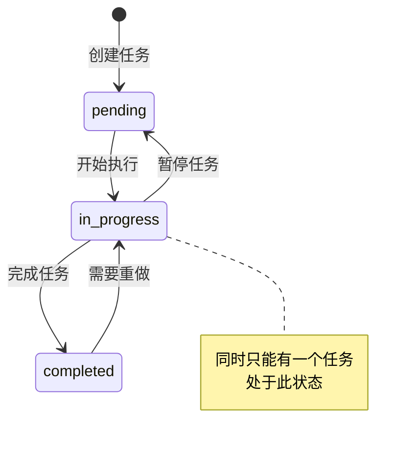
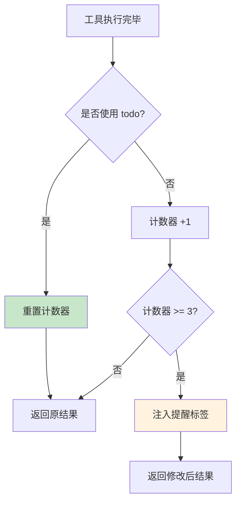
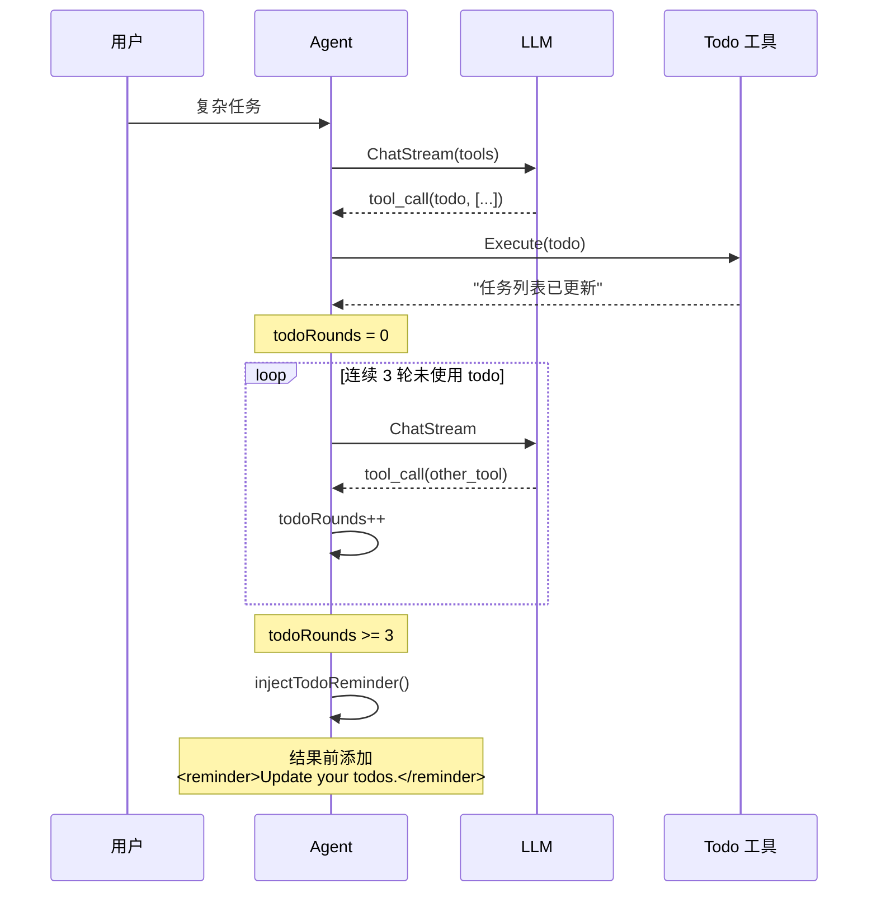

# Todo 任务追踪工具

> **项目**: ai_code (copilot)  
> **知识点**: Todo 任务追踪工具  
> **分类**: 工具系统  
> **分析日期**: 2026-03-27

---

## 目录

- [第一层：直觉建立](#第一层直觉建立)
- [第二层：概念框架](#第二层概念框架)
- [第三层：架构与设计](#第三层架构与设计)
- [第四层：实现深潜](#第四层实现深潜)
- [可视化图表](#可视化图表)
- [总结与延伸](#总结与延伸)

---

## 第一层：直觉建立

### 生活类比

Todo 工具就像**便利贴任务板**。

想象你在白板上贴便利贴跟踪任务进度：

```
[ ] #1: 分析需求
[>] #2: 编写代码    ← 正在做（只有一个）
[ ] #3: 写测试
[x] #4: 阅读文档    ← 已完成

(1/4 completed)
```

### 核心直觉

**为什么 AI 需要 Todo 工具？**

LLM 处理复杂任务时容易"迷失方向"：

```
用户任务: "重构用户模块，添加缓存，写测试"

AI 可能的行为（无 Todo）:
1. 开始重构用户模块...
2. 改了一半，想到要加缓存...
3. 加缓存时发现需要改接口...
4. 改接口时忘记原来要做什么...
5. 最终只完成了一部分
```

**Todo 的作用**：

1. **显式规划** - 强迫 AI 先思考任务分解
2. **进度追踪** - 用户可见任务完成情况
3. **上下文保持** - AI 每轮都能看到当前进度
4. **防止遗漏** - 未完成任务会持续提醒

---

## 第二层：概念框架

### 核心术语

| 术语 | 解释 |
|------|------|
| **Todo Item** | 单个任务项，包含 ID、内容、状态 |
| **Status** | 任务状态：pending / in_progress / completed |
| **In-Progress Constraint** | 同时只能有一个任务处于 in_progress 状态 |

### Todo 状态机

```
pending → in_progress → completed
         ↑_______________|
           (可回退重做)
```

**约束规则**：

1. 同时只能有一个 `in_progress` 任务
2. 最多 20 个 todo 项
3. 每个必须有唯一 ID
4. `content` / `text` 二选一（兼容性）

### 设计目标

1. **任务可视化** - 让用户了解 AI 的工作进度
2. **防止迷失** - AI 复杂任务时有明确的任务清单
3. **进度提醒** - 连续未使用时自动提醒更新

---

## 第三层：架构与设计

### 数据结构

```go
// todoEntry 单个任务项
type todoEntry struct {
    ID      string `json:"id"`      // 唯一标识
    Content string `json:"content"` // 任务内容
    Status  string `json:"status"`  // 状态
}

// 状态常量
const (
    TodoStatusPending    = "pending"
    TodoStatusInProgress = "in_progress"
    TodoStatusCompleted  = "completed"
)
```

### Todo 工具接口

```go
// internal/adapter/tool/todo.go
type TodoTool struct {
    mu     sync.RWMutex   // 并发安全
    items  []todoEntry    // 任务列表
    logger logger.Logger
}

// 工具描述
func (t *TodoTool) Description() string {
    return "Update task list. Track progress on multi-step tasks."
}
```

### 参数 Schema

```json
{
  "type": "object",
  "properties": {
    "todos": {
      "type": "array",
      "description": "The full todo list to persist",
      "items": {
        "type": "object",
        "properties": {
          "id": { "type": "string" },
          "content": { "type": "string" },
          "text": { "type": "string" },
          "status": { 
            "type": "string",
            "enum": ["pending", "in_progress", "completed"]
          }
        },
        "required": ["status"]
      }
    }
  },
  "oneOf": [
    {"required": ["todos"]},
    {"required": ["items"]}
  ]
}
```

### 提醒机制

```go
// internal/usecase/agent.go
func (a *Agent) injectTodoReminder(results []entity.ToolResult, usedTodo bool) []entity.ToolResult {
    if usedTodo {
        a.todoRounds = 0  // 重置计数器
        return results
    }

    a.todoRounds++
    if a.todoRounds >= a.todoNagAfter {  // 默认 3 轮
        // 注入提醒
        results[0].Content = "<reminder>Update your todos.</reminder>\n" + results[0].Content
    }
    return results
}
```

**提醒逻辑**：
- 连续 3 轮未使用 todo 工具
- 自动在工具结果中注入提醒
- 提示 AI 更新任务进度

---

## 第四层：实现深潜

### 核心实现

```go
// internal/adapter/tool/todo.go
func (t *TodoTool) replace(items []todoInputItem) (string, error) {
    // 1. 数量限制
    if len(items) > 20 {
        return "", errors.New("max 20 todos allowed")
    }

    validated := make([]todoEntry, 0, len(items))
    inProgressCount := 0
    seen := make(map[string]struct{}, len(items))

    for i, item := range items {
        // 2. 内容校验
        content := item.Content
        if content == "" {
            content = item.Text  // 兼容别名
        }
        if content == "" {
            return "", errors.New("todo content required")
        }

        // 3. 状态校验
        status := item.Status
        if status != "pending" && status != "in_progress" && status != "completed" {
            return "", errors.New("invalid status: " + status)
        }

        // 4. ID 唯一性校验
        id := item.ID
        if id == "" {
            id = fmt.Sprintf("%d", i+1)
        }
        if _, exists := seen[id]; exists {
            return "", errors.New("duplicate id: " + id)
        }

        // 5. 统计 in_progress 数量
        if status == "in_progress" {
            inProgressCount++
        }

        seen[id] = struct{}{}
        validated = append(validated, todoEntry{...})
    }

    // 6. 同时只能有一个 in_progress
    if inProgressCount > 1 {
        return "", errors.New("only one in_progress allowed")
    }

    t.items = validated
    return t.renderLocked(), nil
}
```

### 渲染输出

```go
func (t *TodoTool) renderLocked() string {
    if len(t.items) == 0 {
        return "No todos."
    }

    done := 0
    lines := make([]string, 0, len(t.items)+1)
    for _, item := range t.items {
        marker := "[ ]"
        if item.Status == "in_progress" {
            marker = "[>]"
        }
        if item.Status == "completed" {
            marker = "[x]"
            done++
        }
        lines = append(lines, fmt.Sprintf("%s #%s: %s", marker, item.ID, item.Content))
    }

    lines = append(lines, fmt.Sprintf("\n(%d/%d completed)", done, len(t.items)))
    return strings.Join(lines, "\n")
}
```

**输出示例**：

```
[ ] #1: 调查项目结构
[>] #2: 实现 todo 工具
[ ] #3: 运行测试

(0/3 completed)
```

### 兼容性设计

```go
// 支持 todos 和 items 两种参数名
type todoInput struct {
    Todos []todoInputItem `json:"todos"`
    Items []todoInputItem `json:"items"`  // 兼容别名
}

// 支持 content 和 text 两种字段名
content := item.Content
if content == "" {
    content = item.Text  // 兼容别名
}
```

---

## 可视化图表

### Todo 状态流转



### Todo 提醒机制流程



### Todo 与 Agent 交互



---

## 总结与延伸

### 核心要点

1. **任务追踪** - 让 AI 保持对复杂任务的关注
2. **状态约束** - 同时只有一个 in_progress，防止并行混乱
3. **自动提醒** - 连续未使用时注入提醒
4. **兼容设计** - 支持多种参数格式

### 设计亮点

| 亮点 | 说明 |
|------|------|
| **In-Progress 约束** | 强制串行处理，避免混乱 |
| **自动提醒** | 3 轮未使用自动提示 |
| **兼容别名** | todos/items, content/text 都支持 |
| **数量限制** | 最多 20 项，防止过度规划 |

### 设计局限

| 局限 | 原因 | 可能改进 |
|------|------|---------|
| 不持久化 | 内存存储 | 文件/数据库存储 |
| 无优先级 | 简单设计 | 添加 priority 字段 |
| 无依赖关系 | 扁平结构 | 支持任务依赖 |

### 面试高频题

1. **Q: 为什么限制只能有一个 in_progress？**
   A: 强制 AI 串行处理任务，避免同时做多件事导致混乱。符合人类工作习惯，也便于用户追踪当前进度。

2. **Q: Todo 提醒机制如何工作？**
   A: Agent 追踪连续未使用 todo 工具的轮数，达到阈值（默认 3）后在工具结果中注入 `<reminder>` 标签，提示 AI 更新任务状态。

3. **Q: 为什么需要 content/text 和 todos/items 别名？**
   A: 兼容不同 LLM 的输出习惯。有些模型可能输出 `content`，有些可能输出 `text`，双字段支持确保都能正确解析。

### 学习路径

1. **前置阅读**：工具注册表
2. **相关源码**：
   - `internal/adapter/tool/todo.go` - Todo 工具实现
   - `internal/usecase/agent.go` - 提醒机制
3. **延伸阅读**：
   - [ReAct: Reasoning + Acting](https://arxiv.org/abs/2210.03629)
   - [Chain of Thought Prompting](https://arxiv.org/abs/2201.11903)
