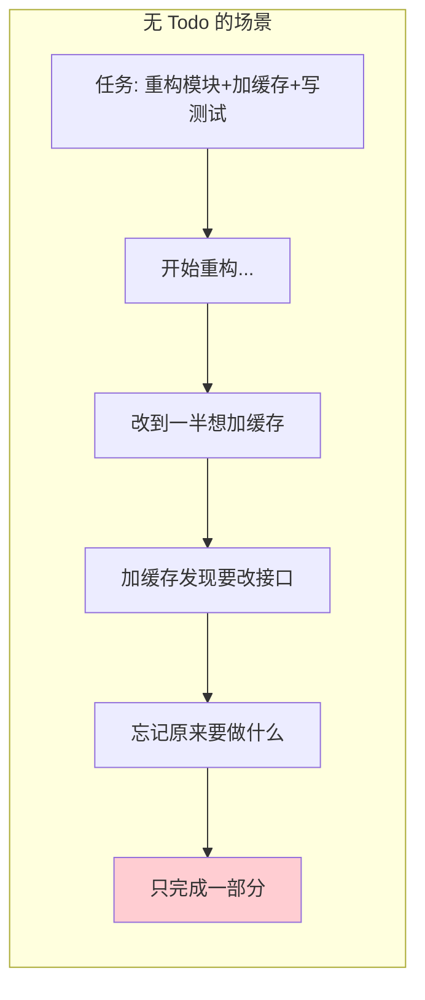
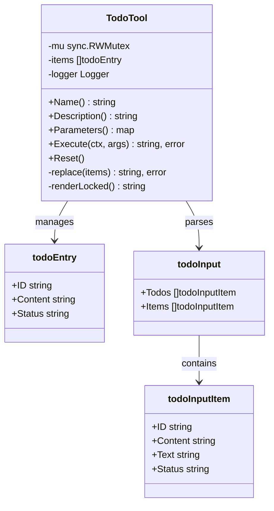
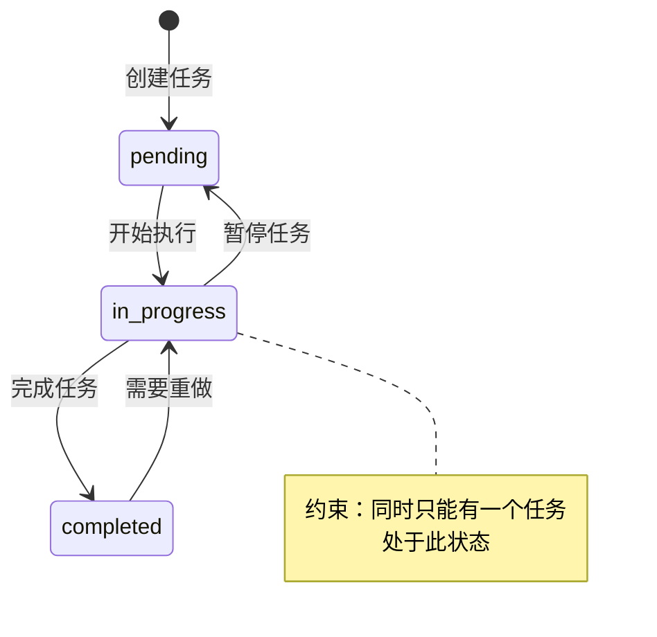
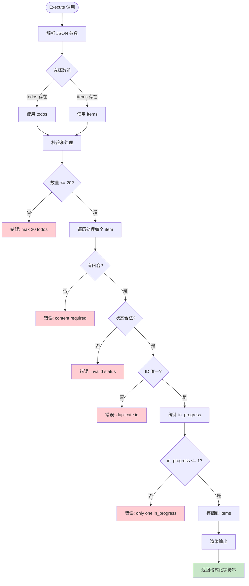
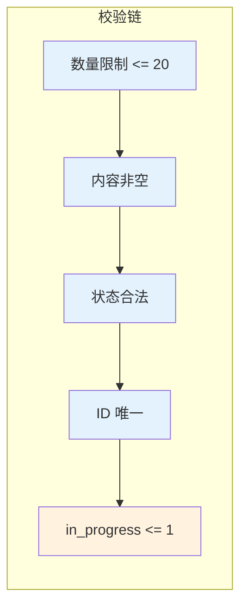
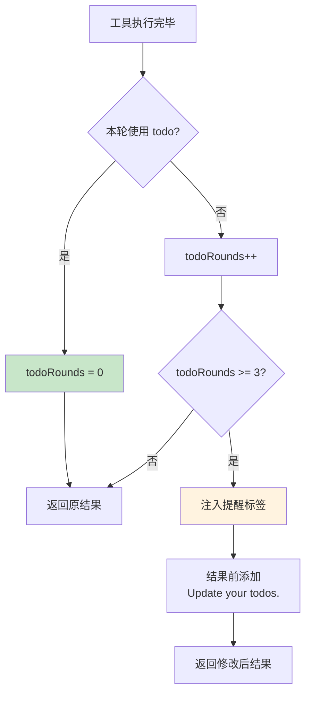
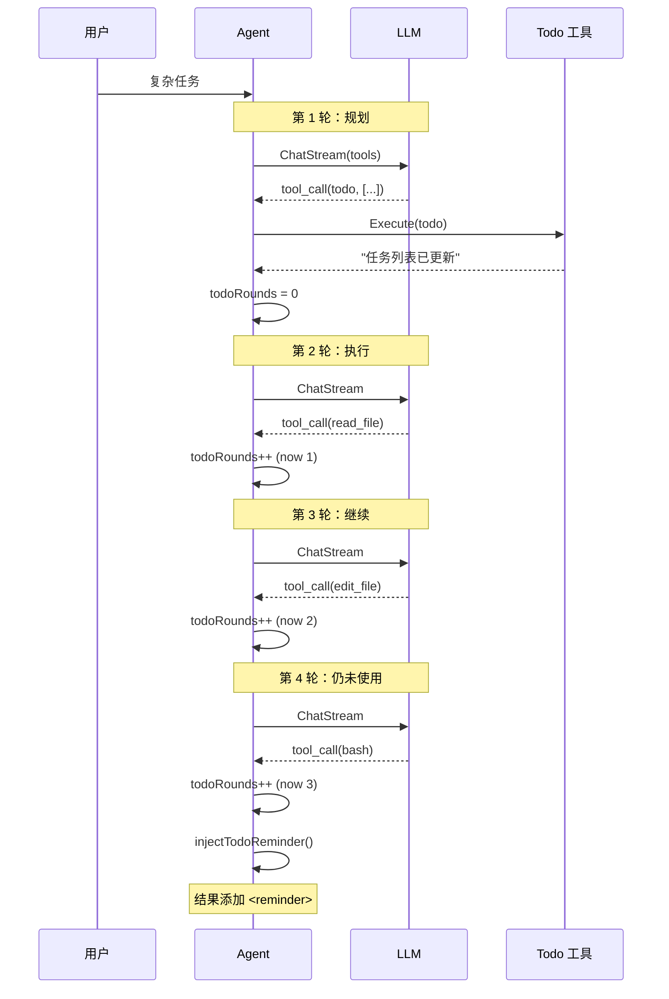
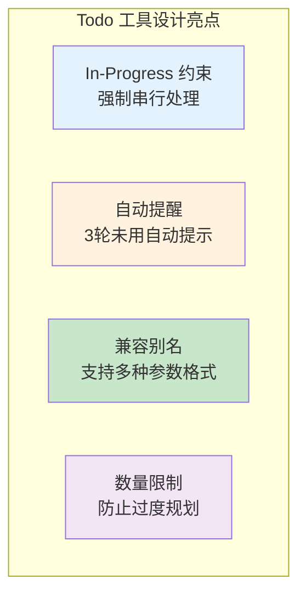

# Todo 任务追踪工具

> **项目**: ai_code (copilot)  
> **分析日期**: 2026-03-30

---

## 一、功能概述

### 1.1 为什么需要 Todo 工具

LLM 处理复杂任务时容易"迷失方向"：



**Todo 的作用**：

| 作用 | 说明 |
|------|------|
| **显式规划** | 强迫 AI 先思考任务分解 |
| **进度追踪** | 用户可见任务完成情况 |
| **上下文保持** | AI 每轮都能看到当前进度 |
| **防止遗漏** | 未完成任务会持续提醒 |

### 1.2 输出效果

```
[ ] #1: 分析需求
[>] #2: 编写代码    ← 正在进行（只有一个）
[ ] #3: 写测试
[x] #4: 阅读文档    ← 已完成

(1/4 completed)
```

---

## 二、数据结构

### 2.1 实体定义



### 2.2 状态常量

```go
const (
    TodoStatusPending    = "pending"      // 待处理
    TodoStatusInProgress = "in_progress"  // 进行中
    TodoStatusCompleted  = "completed"    // 已完成
)
```

### 2.3 状态流转



---

## 三、工具接口

### 3.1 参数定义

```json
{
  "type": "object",
  "properties": {
    "todos": {
      "type": "array",
      "description": "The full todo list to persist",
      "items": {
        "type": "object",
        "properties": {
          "id": {
            "type": "string",
            "description": "The unique identifier of the todo item"
          },
          "content": {
            "type": "string",
            "description": "The task content"
          },
          "text": {
            "type": "string",
            "description": "Alias of content for compatibility"
          },
          "status": {
            "type": "string",
            "description": "The task status",
            "enum": ["pending", "in_progress", "completed"]
          }
        },
        "required": ["status"]
      }
    },
    "items": {
      "type": "array",
      "description": "Alias of todos for compatibility"
    }
  },
  "oneOf": [
    {"required": ["todos"]},
    {"required": ["items"]}
  ]
}
```

### 3.2 兼容性设计

| 参数/字段 | 主名称 | 别名 | 说明 |
|----------|-------|------|------|
| 列表参数 | `todos` | `items` | 兼容不同 LLM 输出 |
| 内容字段 | `content` | `text` | 兼容不同字段命名 |

---

## 四、执行流程

### 4.1 整体流程



### 4.2 核心校验逻辑



### 4.3 核心代码解析

**文件路径**: `internal/adapter/tool/todo.go`

```go
func (t *TodoTool) replace(items []todoInputItem) (string, error) {
    // 1. 数量限制
    if len(items) > 20 {
        return "", errors.New(errors.CodeInvalidInput, "max 20 todos allowed")
    }

    validated := make([]todoEntry, 0, len(items))
    inProgressCount := 0
    seen := make(map[string]struct{}, len(items))

    for i, item := range items {
        // 2. 内容校验（支持 content/text 别名）
        content := item.Content
        if content == "" {
            content = item.Text
        }
        if content == "" {
            return "", errors.New(errors.CodeInvalidInput, "todo content required")
        }

        // 3. 状态校验
        status := item.Status
        if status != TodoStatusPending && 
           status != TodoStatusInProgress && 
           status != TodoStatusCompleted {
            return "", errors.New(errors.CodeInvalidInput, "invalid todo status: "+status)
        }

        // 4. ID 唯一性校验
        id := item.ID
        if id == "" {
            id = fmt.Sprintf("%d", i+1)  // 默认 ID
        }
        if _, exists := seen[id]; exists {
            return "", errors.New(errors.CodeInvalidInput, "duplicate todo id: "+id)
        }

        // 5. 统计 in_progress 数量
        if status == TodoStatusInProgress {
            inProgressCount++
        }

        seen[id] = struct{}{}
        validated = append(validated, todoEntry{
            ID:      id,
            Content: content,
            Status:  status,
        })
    }

    // 6. 同时只能有一个 in_progress ★ 核心约束
    if inProgressCount > 1 {
        return "", errors.New(errors.CodeInvalidInput, 
            "only one todo can be in_progress at a time")
    }

    t.mu.Lock()
    defer t.mu.Unlock()
    t.items = validated

    return t.renderLocked(), nil
}
```

---

## 五、渲染输出

### 5.1 渲染逻辑

```go
func (t *TodoTool) renderLocked() string {
    if len(t.items) == 0 {
        return "No todos."
    }

    done := 0
    lines := make([]string, 0, len(t.items)+1)
    for _, item := range t.items {
        marker := "[ ]"
        if item.Status == TodoStatusInProgress {
            marker = "[>]"
        }
        if item.Status == TodoStatusCompleted {
            marker = "[x]"
            done++
        }
        lines = append(lines, fmt.Sprintf("%s #%s: %s", marker, item.ID, item.Content))
    }

    lines = append(lines, fmt.Sprintf("\n(%d/%d completed)", done, len(t.items)))
    return joinLines(lines)
}
```

### 5.2 输出格式

| 状态 | 标记 | 示例 |
|------|------|------|
| pending | `[ ]` | `[ ] #1: 分析需求` |
| in_progress | `[>]` | `[>] #2: 编写代码` |
| completed | `[x]` | `[x] #3: 阅读文档` |

---

## 六、提醒机制

### 6.1 设计目的

当 LLM 连续多轮未使用 todo 工具时，自动注入提醒，防止 LLM 忘记更新任务进度。

### 6.2 提醒流程



### 6.3 核心代码解析

**文件路径**: `internal/usecase/agent.go`

```go
func (a *Agent) injectTodoReminder(results []entity.ToolResult, usedTodo bool) []entity.ToolResult {
    // 如果本轮使用了 todo 工具，重置计数器
    if usedTodo {
        a.todoRounds = 0
        return results
    }

    // 未使用 todo，计数器递增
    a.todoRounds++

    // 未达到提醒阈值，直接返回
    if a.todoRounds < a.todoNagAfter {  // 默认 3
        return results
    }

    // 没有结果，无需注入
    if len(results) == 0 {
        return results
    }

    // 在第一个工具结果前添加提醒 ★
    results[0].Content = "<reminder>Update your todos.</reminder>\n" + results[0].Content
    return results
}
```

### 6.4 配置参数

| 参数 | 默认值 | 说明 |
|------|--------|------|
| `todoNagAfter` | 3 | 连续几轮未使用后提醒 |

---

## 七、Agent 集成

### 7.1 交互序列



### 7.2 状态追踪

```mermaid
stateDiagram-v2
    [*] --> Round0: 使用 todo
    
    state "未使用 todo" as NotUsed {
        Round1 --> Round2: ++
        Round2 --> Round3: ++
    }
    
    Round3 --> Inject: 达到阈值
    Inject --> [*]: 注入提醒
    
    NotUsed --> Round0: 使用 todo (重置)
    Round0 --> Round0: 继续使用
    
    note right of Inject
        在工具结果前添加
        <reminder>Update your todos.</reminder>
    end note
```



---

## 八、设计总结

### 8.1 约束规则

| 规则 | 原因 |
|------|------|
| 最多 20 个任务 | 防止过度规划 |
| 同时只能一个 in_progress | 强制串行处理 |
| ID 必须唯一 | 防止混淆 |
| content/text 别名 | 兼容性 |
| todos/items 别名 | 兼容性 |

### 8.2 设计亮点



### 8.3 设计局限

| 局限 | 原因 | 可能改进 |
|------|------|---------|
| 不持久化 | 内存存储 | 文件/数据库存储 |
| 无优先级 | 简单设计 | 添加 priority 字段 |
| 无依赖关系 | 扁平结构 | 支持任务依赖 |
| 无子任务 | 单层结构 | 支持嵌套任务 |