# 子智能体架构设计

> **项目**: ai_code (copilot)  
> **分析日期**: 2026-03-30

---

## 一、概念概述

### 1.1 什么是子智能体

子智能体（SubAgent）是一个拥有**独立上下文**的任务执行单元，通过 `task` 工具启动。

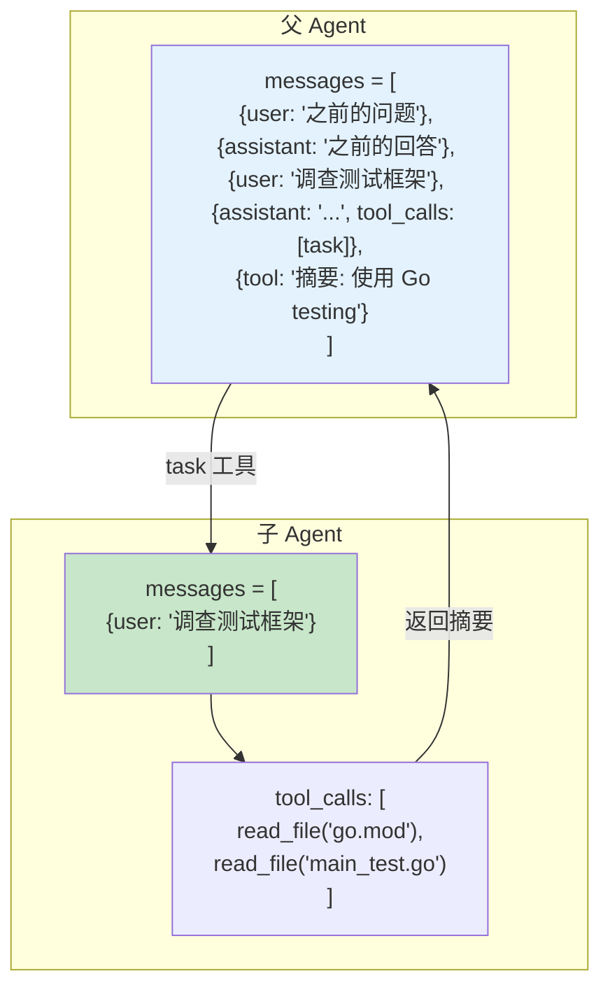

### 1.2 为什么需要子智能体

**问题：上下文膨胀**

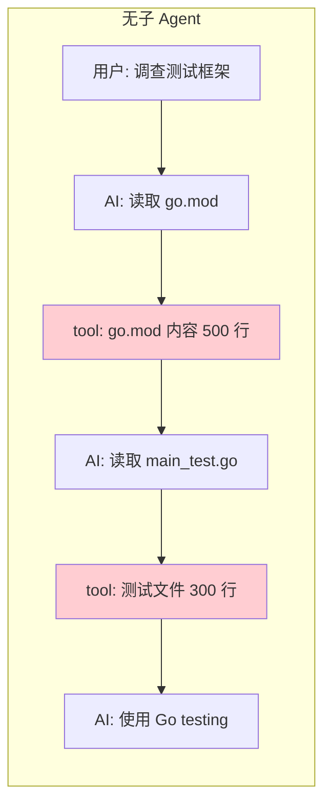

**解决方案：上下文隔离**

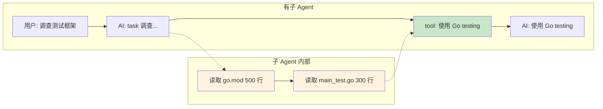

### 1.3 核心优势

| 优势 | 说明 |
|------|------|
| **上下文隔离** | 子 Agent 的工具调用对父 Agent 不可见 |
| **Token 节约** | 中间步骤不污染父上下文 |
| **任务分解** | 复杂任务可拆分为独立子任务 |
| **防止递归** | 子 Agent 不能再创建子 Agent |

---

## 二、架构设计

### 2.1 组件关系

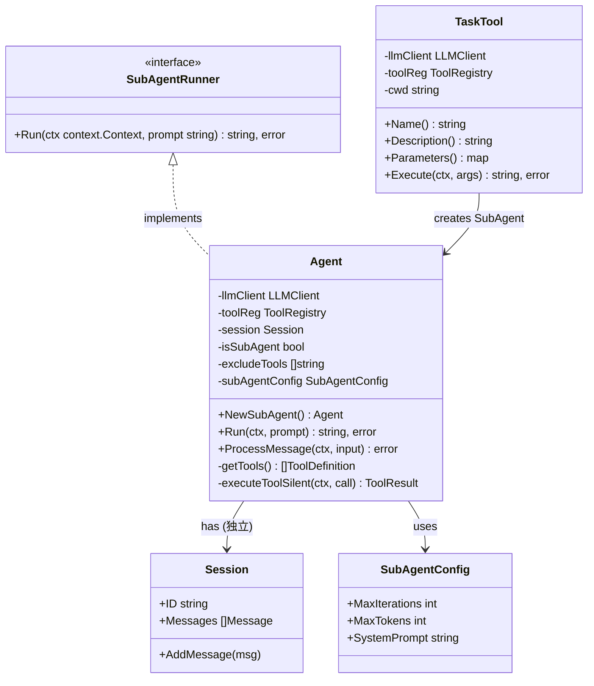

### 2.2 接口定义

**文件路径**: `internal/port/subagent.go`

```go
// SubAgentRunner 子智能体运行器接口
type SubAgentRunner interface {
    // Run 执行子智能体任务
    // prompt: 子任务描述
    // 返回: 任务执行摘要（不包含中间工具调用细节）
    Run(ctx context.Context, prompt string) (string, error)
}

// SubAgentConfig 子智能体配置
type SubAgentConfig struct {
    MaxIterations int      // 最大迭代次数（防止无限循环）
    MaxTokens     int      // 最大生成 token 数
    SystemPrompt  string   // 系统提示词
}
```

### 2.3 在系统中的位置

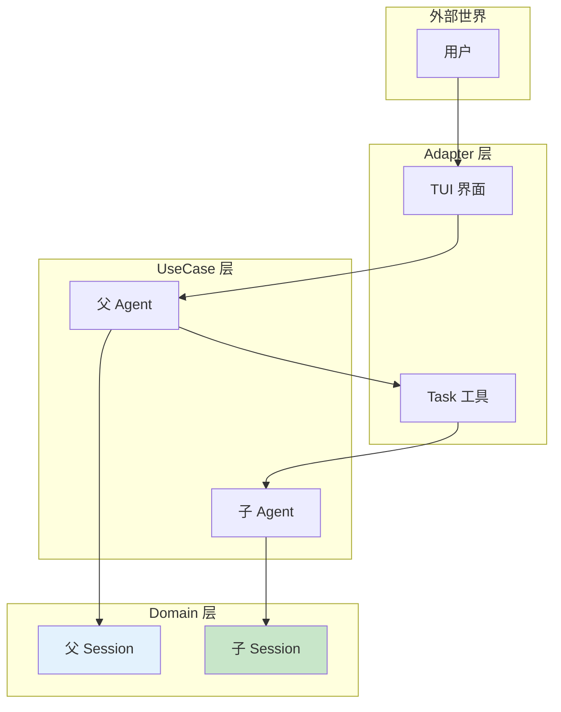

---

## 三、Task 工具实现

### 3.1 工具定义

```json
{
  "type": "object",
  "properties": {
    "prompt": {
      "type": "string",
      "description": "Detailed instructions for the subagent to execute"
    },
    "description": {
      "type": "string",
      "description": "Short description of the task (for logging)"
    }
  },
  "required": ["prompt"]
}
```

### 3.2 执行流程

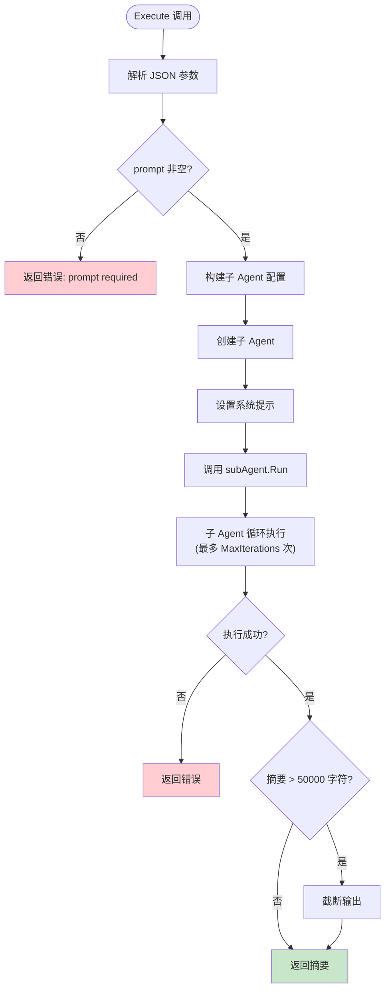

### 3.3 核心代码解析

**文件路径**: `internal/adapter/tool/task.go`

```go
func (t *TaskTool) Execute(ctx context.Context, args string) (string, error) {
    var params TaskToolParams
    if err := json.Unmarshal([]byte(args), &params); err != nil {
        return "", err
    }

    if params.Prompt == "" {
        return "Error: prompt is required", nil
    }

    // 构建子 Agent 配置
    config := SubAgentConfig{
        MaxIterations: 30,
        MaxTokens:     8000,
    }
    for _, opt := range t.subAgentOpts {
        opt(&config)
    }

    // 构建系统提示
    subAgentSystem := config.SystemPrompt
    if subAgentSystem == "" {
        if t.cwd != "" {
            subAgentSystem = "You are a coding subagent at " + t.cwd + 
                ". Complete the given task, then summarize your findings."
        } else {
            subAgentSystem = "You are a coding subagent. Complete the given task, then summarize your findings."
        }
    }

    // 创建子 Agent 配置
    agentConfig := usecase.AgentConfig{MaxTokens: config.MaxTokens}
    subAgentConfig := port.SubAgentConfig{
        MaxIterations: config.MaxIterations,
        MaxTokens:     config.MaxTokens,
        SystemPrompt:  subAgentSystem,
    }

    // ★ 创建子 Agent（独立 Session）
    subAgent := usecase.NewSubAgent(t.llmClient, t.toolReg, agentConfig, subAgentConfig)

    // 执行子 Agent
    summary, err := subAgent.Run(ctx, params.Prompt)
    if err != nil {
        return "Subagent error: " + err.Error(), nil
    }

    // 截断过长输出
    if len(summary) > 50000 {
        summary = summary[:50000] + "\n... (output truncated)"
    }

    if summary == "" {
        summary = "(no summary returned)"
    }

    return summary, nil
}
```

---

## 四、子 Agent 创建与运行

### 4.1 创建流程

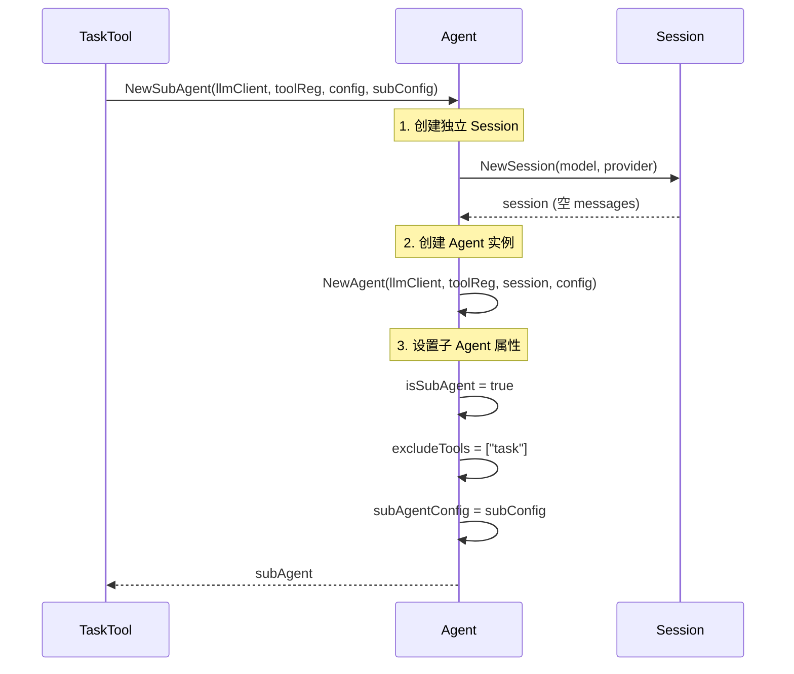

### 4.2 核心代码解析

**文件路径**: `internal/usecase/agent.go`

```go
// NewSubAgent 创建子 Agent
func NewSubAgent(llmClient port.LLMClient, toolReg port.ToolRegistry, 
                 config AgentConfig, subConfig port.SubAgentConfig) *Agent {
    // ★ 创建独立的 Session
    session := entity.NewSession(llmClient.GetModel(), llmClient.GetName())

    agent := NewAgent(llmClient, toolReg, session, config)
    
    // ★ 设置子 Agent 标识
    agent.isSubAgent = true
    agent.excludeTools = []string{"task"}  // 防止递归
    agent.subAgentConfig = subConfig

    // 设置子 Agent 的系统提示
    if subConfig.SystemPrompt != "" {
        agent.system = subConfig.SystemPrompt
    }

    return agent
}
```

### 4.3 运行流程

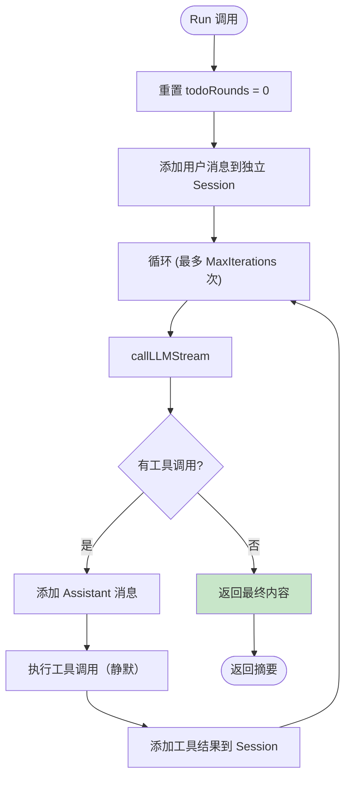

### 4.4 Run 方法实现

```go
// Run 实现 SubAgentRunner 接口
func (a *Agent) Run(ctx context.Context, prompt string) (string, error) {
    // 重置 todo 计数
    a.todoRounds = 0

    // ★ 创建独立的用户消息
    userMsg := entity.NewMessage(entity.RoleUser, prompt)
    a.session.AddMessage(userMsg)

    var finalContent strings.Builder
    maxIterations := a.subAgentConfig.MaxIterations
    if maxIterations == 0 {
        maxIterations = 30
    }

    for iterationCount := 0; iterationCount < maxIterations; iterationCount++ {
        select {
        case <-ctx.Done():
            return finalContent.String(), errors.New(errors.CodeContextCanceled, "context canceled")
        default:
        }

        // 调用 LLM
        content, toolCalls, err := a.callLLMStream(ctx)
        if err != nil {
            return finalContent.String(), fmt.Errorf("API call failed: %v", err)
        }

        // ★ 如果没有工具调用，返回最终内容
        if len(toolCalls) == 0 {
            finalContent.WriteString(content)
            return finalContent.String(), nil
        }

        // 添加 assistant 消息
        assistantMsg := entity.NewMessage(entity.RoleAssistant, content).
            WithToolCalls(toolCalls)
        a.session.AddMessage(assistantMsg)

        // 执行工具调用（静默执行，不输出到 UI）
        for _, toolCall := range toolCalls {
            result, err := a.executeToolSilent(ctx, toolCall)
            if err != nil {
                a.logger.Error("tool execution failed",
                    logger.F("tool", toolCall.GetName()),
                    logger.F("error", err),
                )
            }
            
            // 添加工具结果到子 Agent 的 Session
            toolMsg := entity.NewMessage(entity.RoleTool, result.Content).
                WithToolCallID(result.ToolCallID)
            a.session.AddMessage(toolMsg)
        }
    }

    return finalContent.String(), fmt.Errorf("max iterations (%d) reached", maxIterations)
}
```

---

## 五、工具过滤机制

### 5.1 设计目的

防止子 Agent 递归创建子 Agent，导致资源耗尽。

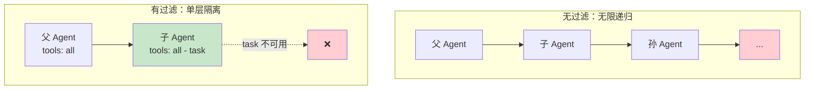

### 5.2 过滤实现

```go
// getTools 获取工具列表
// 子 Agent 需要排除特定工具（如 task）
func (a *Agent) getTools() []port.ToolDefinition {
    allTools := a.toolReg.ToLLMTools()

    // 如果不是子 Agent 或者没有排除工具，直接返回
    if !a.isSubAgent || len(a.excludeTools) == 0 {
        return allTools
    }

    // ★ 过滤排除的工具
    excludeSet := make(map[string]bool)
    for _, name := range a.excludeTools {
        excludeSet[name] = true
    }

    filtered := make([]port.ToolDefinition, 0, len(allTools))
    for _, tool := range allTools {
        if !excludeSet[tool.Function.Name] {
            filtered = append(filtered, tool)
        }
    }

    return filtered
}
```

### 5.3 工具对比

| Agent 类型 | excludeTools | 可用工具 |
|-----------|--------------|---------|
| 父 Agent | `[]` | bash, read_file, write_file, edit_file, todo, **task** |
| 子 Agent | `["task"]` | bash, read_file, write_file, edit_file, todo |

---

## 六、父子 Agent 交互

### 6.1 完整交互序列

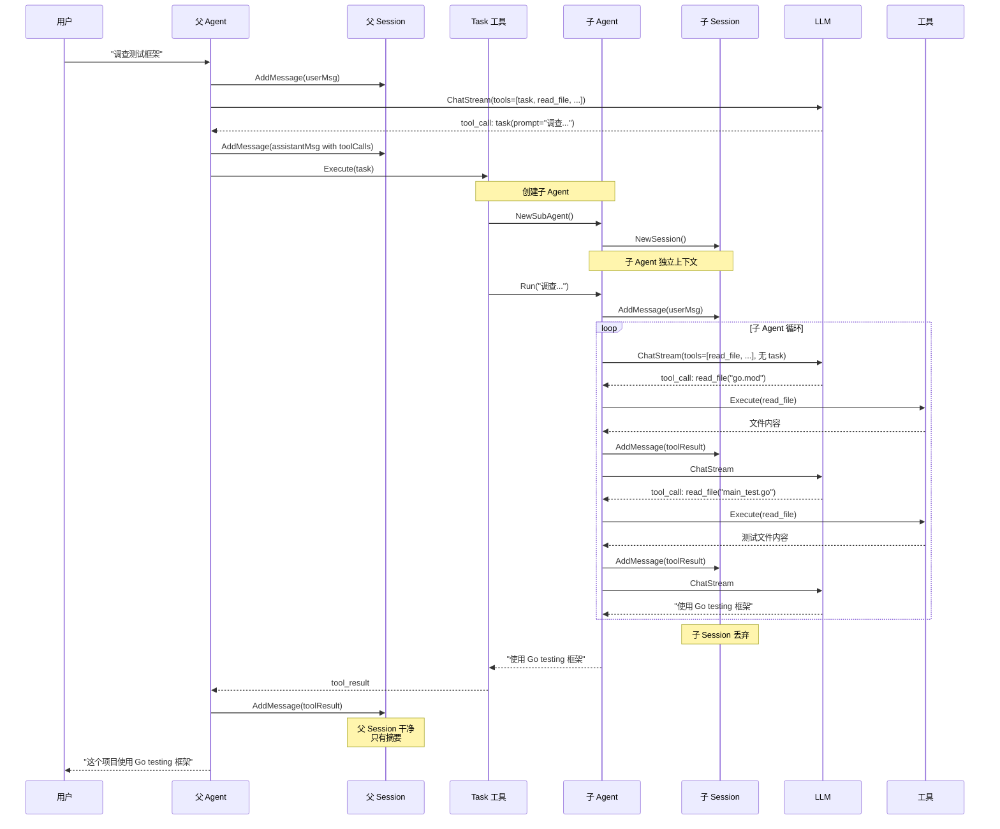

### 6.2 上下文对比

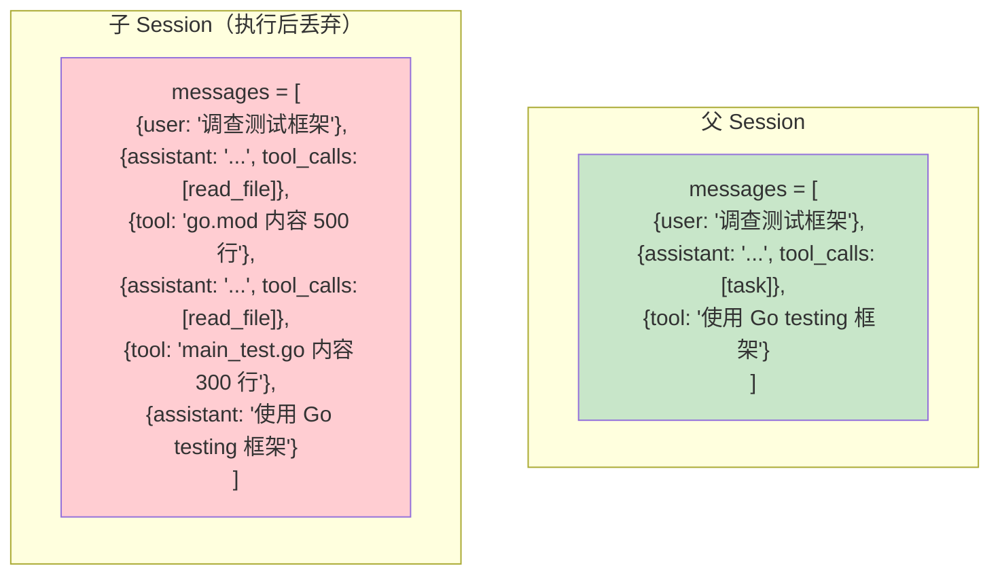

---

## 七、静默执行模式

### 7.1 设计目的

子 Agent 执行工具时不发送输出到父 Agent UI，保持父 Agent 输出干净。

### 7.2 实现对比

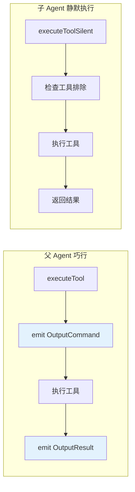

### 7.3 核心代码

```go
// executeToolSilent 静默执行工具（不发送输出）
func (a *Agent) executeToolSilent(ctx context.Context, call entity.ToolCall) (entity.ToolResult, error) {
    // 检查工具是否被排除
    for _, excluded := range a.excludeTools {
        if call.GetName() == excluded {
            return entity.ToolResult{
                ToolCallID: call.ID,
                Content:    "Error: This tool is not available in subagent mode",
                IsError:    true,
            }, nil
        }
    }

    // 执行工具（无 emit 输出）
    return a.toolReg.ExecuteTool(ctx, call)
}
```

---

## 八、设计总结

### 8.1 隔离机制

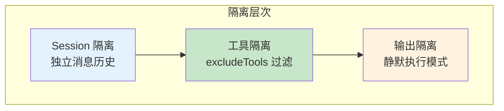

### 8.2 设计亮点

| 亮点 | 说明 |
|------|------|
| **工具驱动** | 子 Agent 通过 task 工具启动，LLM 自主决策 |
| **安全隔离** | excludeTools 机制防止递归 |
| **成本节约** | 中间步骤不污染父上下文 |
| **灵活配置** | 支持自定义迭代次数、系统提示 |
| **资源共享** | LLM Client 和 Tool Registry 共享 |

### 8.3 设计局限

| 局限 | 原因 | 可能改进 |
|------|------|---------|
| 无进度反馈 | 子 Agent 静默执行 | 添加回调机制 |
| 无并发限制 | 简单实现 | 添加并发池 |
| 无超时控制 | 依赖 ctx | 添加独立超时 |
| 单层嵌套 | 只排除 task | 支持多层嵌套 |

### 8.4 适用场景

| 场景 | 是否适用 | 原因 |
|------|---------|------|
| 调查代码库 | ✅ 适用 | 需要多轮探索，但只需要最终答案 |
| 搜索分析 | ✅ 适用 | 中间步骤多，结果简洁 |
| 修改文件 | ⚠️ 视情况 | 如果需要用户确认，不适合 |
| 长时间任务 | ❌ 不适用 | 无进度反馈 |