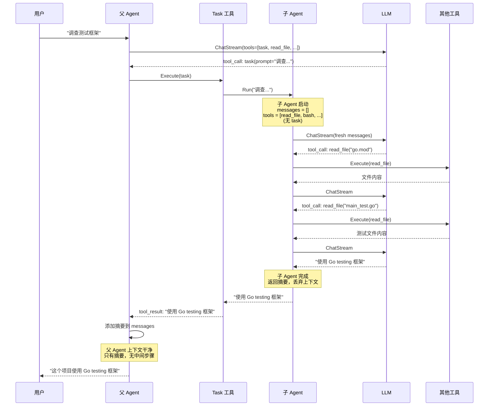
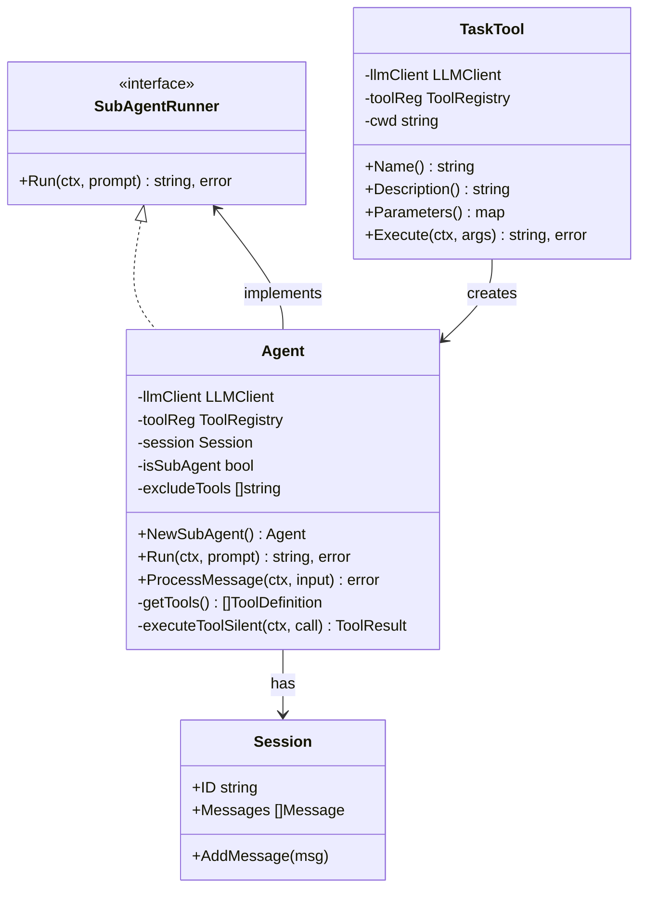

# 子智能体架构设计

> **项目**: ai_code (copilot)  
> **知识点**: 子智能体架构设计 (SubAgent)  
> **分类**: 高级架构  
> **分析日期**: 2026-03-27

---

## 目录

- [第一层：直觉建立](#第一层直觉建立)
- [第二层：概念框架](#第二层概念框架)
- [第三层：架构与设计](#第三层架构与设计)
- [第四层：实现深潜](#第四层实现深潜)
- [可视化图表](#可视化图表)
- [总结与延伸](#总结与延伸)

---

## 第一层：直觉建立

### 生活类比

子智能体就像**项目经理和外包团队**的关系。

**项目经理（父 Agent）**：
- 拥有完整的上下文（所有会议记录、决策历史）
- 需要保持信息的"干净"，不能被琐事淹没
- 当需要专业调查时，派遣外包团队

**外包团队（子 Agent）**：
- 只有任务描述，没有历史包袱
- 做完工作后，只提交一份报告（摘要）
- 报告归档到项目经理的文件夹，团队解散

### 核心直觉

**为什么需要子智能体？**

想象你问 AI："这个项目用什么测试框架？"

**没有子智能体**：
```
messages = [
  {user: "之前的问题..."},
  {assistant: "之前的回答..."},
  {user: "这个项目用什么测试框架？"},
  {assistant: "让我看看...", tool_calls: [read_file("go.mod"), read_file("main.go"), ...]},
  {tool: "go.mod 内容: ..."},
  {tool: "main.go 内容: ..."},
  {assistant: "让我看看测试文件...", tool_calls: [read_file("main_test.go")]},
  {tool: "main_test.go 内容: ..."},
  {assistant: "这个项目使用 Go 标准测试框架 testing"}
]

# 问题：上下文膨胀！5 次工具调用的内容永久留在对话中
# 后续每次调用都要传递这些无用信息
```

**有子智能体**：
```
messages = [
  {user: "之前的问题..."},
  {assistant: "之前的回答..."},
  {user: "这个项目用什么测试框架？"},
  {assistant: "让我调查一下...", tool_calls: [task("调查测试框架")]},
  {tool: "这个项目使用 Go 标准测试框架 testing"},
  {assistant: "这个项目使用 Go 标准测试框架 testing"}
]

# 优势：子 Agent 的 5 次工具调用对父 Agent 不可见
# 父 Agent 上下文保持干净
# Token 消耗大幅降低
```

### 核心洞察

> **"Process isolation gives context isolation for free."**  
> 进程隔离天然带来上下文隔离。

子智能体通过独立的 `messages` 数组实现上下文隔离：
- 父 Agent：`messages = [历史对话...]`
- 子 Agent：`messages = []`（全新开始）
- 子 Agent 完成后，只返回摘要，整个上下文被丢弃

---

## 第二层：概念框架

### 核心术语

| 术语 | 解释 |
|------|------|
| **SubAgent** | 子智能体，拥有独立上下文的任务执行单元 |
| **Task Tool** | 任务工具，父 Agent 用于启动子 Agent |
| **Context Isolation** | 上下文隔离，子 Agent 的工具调用对父 Agent 不可见 |
| **Tool Filtering** | 工具过滤，子 Agent 排除 task 工具防止递归 |
| **Fresh Context** | 全新上下文，子 Agent 启动时 messages 为空 |

### 设计目标

1. **上下文隔离** - 子 Agent 的中间步骤不污染父 Agent
2. **任务分解** - 复杂任务可拆分为独立子任务
3. **成本节约** - 减少 Token 消耗
4. **防止递归** - 子 Agent 不能再创建子 Agent

### 在系统中的位置

```
用户输入
    │
    ▼
┌─────────────────────────────────────────────────────────┐
│                    父 Agent                              │
│  ┌─────────────────────────────────────────────────┐    │
│  │ messages = [                                     │    │
│  │   {user: "修复 bug"},                           │    │
│  │   {assistant: "...", tool_calls: [task(...)]}  │    │
│  │   {tool: "摘要: bug 已修复"}                    │    │
│  │ ]                                                │    │
│  └─────────────────────────────────────────────────┘    │
│                    │                                     │
│                    │ task 工具                           │
│                    ▼                                     │
│  ┌─────────────────────────────────────────────────┐    │
│  │              子 Agent (独立上下文)               │    │
│  │  messages = [                                    │    │
│  │    {user: "调查并修复 bug"}                     │    │
│  │    {assistant: "...", tool_calls: [read_file]}  │    │
│  │    {tool: "文件内容..."}                         │    │
│  │    {assistant: "...", tool_calls: [edit_file]}  │    │
│  │    {tool: "已编辑..."}                           │    │
│  │    {assistant: "bug 已修复，摘要: ..."}         │    │
│  │  ]                                               │    │
│  │         ↑ 完成后丢弃整个上下文                   │    │
│  └─────────────────────────────────────────────────┘    │
│                    │                                     │
│                    │ 返回摘要                            │
│                    ▼                                     │
│  {tool: "摘要: bug 已修复"}                             │
└─────────────────────────────────────────────────────────┘
```

---

## 第三层：架构与设计

### 架构决策

#### 为什么选择工具而非直接 API？

| 方案 | 优点 | 缺点 |
|------|------|------|
| **直接 API 调用** | 简单直接 | 父 Agent 无法控制何时使用 |
| **Task 工具** | LLM 自主决策，灵活 | 需要额外实现 |

**本项目选择**：Task 工具

**原因**：
- LLM 根据任务复杂度自主决定是否需要子 Agent
- 保持 Agent 循环的统一性
- 符合"工具驱动"的设计理念

#### 为什么禁止子 Agent 创建子 Agent？

**防止无限递归**：
```
父 Agent → 子 Agent → 孙 Agent → ...
```

这会导致：
1. 资源耗尽
2. 难以调试
3. 任务追踪困难

**解决方案**：子 Agent 工具列表排除 `task` 工具

### 核心组件

#### 1. SubAgentRunner 接口

```go
// internal/port/subagent.go
type SubAgentRunner interface {
    Run(ctx context.Context, prompt string) (string, error)
}
```

**职责**：
- 定义子 Agent 的运行接口
- 输入：任务描述
- 输出：任务摘要

#### 2. Task 工具

```go
// internal/adapter/tool/task.go
type TaskTool struct {
    llmClient    port.LLMClient  // 共享 LLM 客户端
    toolReg      port.ToolRegistry  // 共享工具注册表
    cwd          string          // 共享工作目录
}
```

**职责**：
- 作为父 Agent 的工具
- 创建并运行子 Agent
- 返回摘要结果

#### 3. Agent 扩展

```go
// internal/usecase/agent.go
type Agent struct {
    // ... 原有字段
    
    // SubAgent 相关
    isSubAgent     bool              // 是否为子 Agent
    excludeTools   []string          // 排除的工具列表
    subAgentConfig port.SubAgentConfig
}
```

**新增能力**：
- `NewSubAgent()` - 创建子 Agent
- `Run()` - 实现 SubAgentRunner 接口
- `getTools()` - 过滤排除的工具

### 工具过滤机制

```go
// internal/usecase/agent.go
func (a *Agent) getTools() []port.ToolDefinition {
    allTools := a.toolReg.ToLLMTools()

    // 如果不是子 Agent，直接返回所有工具
    if !a.isSubAgent {
        return allTools
    }

    // 过滤排除的工具
    excludeSet := make(map[string]bool)
    for _, name := range a.excludeTools {
        excludeSet[name] = true
    }

    filtered := make([]port.ToolDefinition, 0)
    for _, tool := range allTools {
        if !excludeSet[tool.Function.Name] {
            filtered = append(filtered, tool)
        }
    }

    return filtered
}
```

**关键点**：
- 父 Agent：`excludeTools = []` → 所有工具可用
- 子 Agent：`excludeTools = ["task"]` → task 工具不可见

---

## 第四层：实现深潜

### Task 工具实现

```go
// internal/adapter/tool/task.go
func (t *TaskTool) Execute(ctx context.Context, args string) (string, error) {
    var params TaskToolParams
    json.Unmarshal([]byte(args), &params)

    // 构建子 Agent 系统提示
    subAgentSystem := "You are a coding subagent. Complete the given task, then summarize your findings."
    
    // 创建子 Agent（独立 Session）
    agentConfig := usecase.AgentConfig{MaxTokens: 8000}
    subAgentConfig := port.SubAgentConfig{
        MaxIterations: 30,
        SystemPrompt:  subAgentSystem,
    }
    
    subAgent := usecase.NewSubAgent(t.llmClient, t.toolReg, agentConfig, subAgentConfig)

    // 执行子 Agent
    summary, err := subAgent.Run(ctx, params.Prompt)
    
    // 截断过长输出
    if len(summary) > 50000 {
        summary = summary[:50000] + "\n... (output truncated)"
    }

    return summary, nil
}
```

**关键设计**：
1. **共享 LLM Client** - 复用连接，节省资源
2. **共享 Tool Registry** - 子 Agent 可用所有基础工具
3. **独立 Session** - 子 Agent 有自己的上下文

### 子 Agent 创建

```go
// internal/usecase/agent.go
func NewSubAgent(llmClient port.LLMClient, toolReg port.ToolRegistry, 
                 config AgentConfig, subConfig port.SubAgentConfig) *Agent {
    // 创建独立的 Session
    session := entity.NewSession(llmClient.GetModel(), llmClient.GetName())

    agent := NewAgent(llmClient, toolReg, session, config)
    agent.isSubAgent = true
    agent.excludeTools = []string{"task"}  // 防止递归
    agent.subAgentConfig = subConfig

    return agent
}
```

**隔离机制**：
- `session` - 独立的消息历史
- `isSubAgent` - 标识子 Agent 身份
- `excludeTools` - 工具过滤列表

### 子 Agent 运行

```go
// internal/usecase/agent.go
func (a *Agent) Run(ctx context.Context, prompt string) (string, error) {
    // 创建独立的用户消息
    userMsg := entity.NewMessage(entity.RoleUser, prompt)
    a.session.AddMessage(userMsg)

    var finalContent strings.Builder
    maxIterations := 30

    for i := 0; i < maxIterations; i++ {
        // 调用 LLM（工具已过滤）
        content, toolCalls, err := a.callLLMStream(ctx)
        
        // 无工具调用，返回最终内容
        if len(toolCalls) == 0 {
            return content, nil
        }

        // 执行工具调用（静默执行，不输出到 UI）
        for _, call := range toolCalls {
            result, _ := a.executeToolSilent(ctx, call)
            // 添加到子 Agent 的 session
            a.session.AddMessage(entity.NewMessage(entity.RoleTool, result.Content))
        }
    }

    return finalContent.String(), nil
}
```

**与父 Agent 的区别**：
- `executeToolSilent()` - 不发送输出到 UI
- 独立的 `session` - 消息隔离
- 返回摘要而非继续循环

### 工具执行静默模式

```go
// internal/usecase/agent.go
func (a *Agent) executeToolSilent(ctx context.Context, call entity.ToolCall) (entity.ToolResult, error) {
    // 检查工具是否被排除
    for _, excluded := range a.excludeTools {
        if call.GetName() == excluded {
            return entity.ToolResult{
                Content: "Error: This tool is not available in subagent mode",
                IsError: true,
            }, nil
        }
    }

    return a.toolReg.ExecuteTool(ctx, call)
}
```

---

## 可视化图表

### 父子 Agent 交互序列图



### 上下文对比图

```mermaid
graph TB
    subgraph "无子 Agent"
        A1[用户: 调查测试框架]
        A2[AI: 读取 go.mod]
        A3[tool: go.mod 内容...]
        A4[AI: 读取 main_test.go]
        A5[tool: 测试文件内容...]
        A6[AI: 使用 Go testing]
        A1 --> A2 --> A3 --> A4 --> A5 --> A6
    end
    
    subgraph "有子 Agent"
        B1[用户: 调查测试框架]
        B2[AI: task 调查...]
        B3[tool: 使用 Go testing]
        B4[AI: 使用 Go testing]
        B1 --> B2 --> B3 --> B4
    end
    
    style A3 fill:#ffcdd2
    style A5 fill:#ffcdd2
    style B3 fill:#c8e6c9
```



### 类图：SubAgent 相关结构



---

## 总结与延伸

### 核心要点

1. **上下文隔离** - 子 Agent 使用独立 Session，中间步骤对父 Agent 不可见
2. **工具过滤** - 子 Agent 排除 task 工具，防止递归创建
3. **摘要返回** - 子 Agent 只返回最终摘要，丢弃整个上下文
4. **资源共享** - LLM Client 和 Tool Registry 共享，Session 独立

### 设计亮点

| 亮点 | 说明 |
|------|------|
| **工具驱动** | 子 Agent 通过 task 工具启动，LLM 自主决策 |
| **安全隔离** | excludeTools 机制防止递归 |
| **成本节约** | 中间步骤不污染父上下文，减少 Token |
| **灵活配置** | 支持自定义迭代次数、系统提示 |

### 设计局限

| 局限 | 原因 | 可能改进 |
|------|------|---------|
| 无进度反馈 | 子 Agent 静默执行 | 可添加回调机制 |
| 无并发限制 | 简单实现 | 可添加并发池 |
| 无超时控制 | 依赖 ctx | 可添加独立超时 |

### 与其他方案对比

| 方案 | 上下文隔离 | 实现复杂度 | 成本 |
|------|----------|-----------|------|
| **无子 Agent** | ❌ | 低 | 高 |
| **子 Agent (本项目)** | ✅ | 中 | 低 |
| **多进程隔离** | ✅✅ | 高 | 低 |

### 面试高频题

1. **Q: 子智能体如何实现上下文隔离？**
   A: 通过独立的 Session 实体。父 Agent 和子 Agent 各有自己的 messages 数组，子 Agent 的工具调用结果只存在于子 Agent 的 session 中，完成后整个 session 被丢弃。

2. **Q: 为什么子智能体不能创建子智能体？**
   A: 防止无限递归。通过 excludeTools 机制，子 Agent 的工具列表排除了 task 工具，因此子 Agent 无法再调用 task 工具。

3. **Q: 子智能体适用于什么场景？**
   A: 适用于"探索型"任务，如调查代码库、回答问题、搜索分析等。这些任务可能需要多次工具调用，但父 Agent 只需要最终答案。

### 学习路径

1. **前置阅读**：Agent 循环、工具注册表
2. **相关源码**：
   - `internal/port/subagent.go` - 接口定义
   - `internal/adapter/tool/task.go` - Task 工具
   - `internal/usecase/agent.go` - Agent 扩展
3. **延伸阅读**：
   - [Claude Code: Subagents](https://www.anthropic.com/research/claude-code)
   - [ReAct: Reasoning + Acting](https://arxiv.org/abs/2210.03629)
